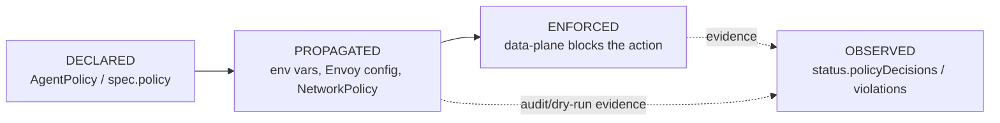
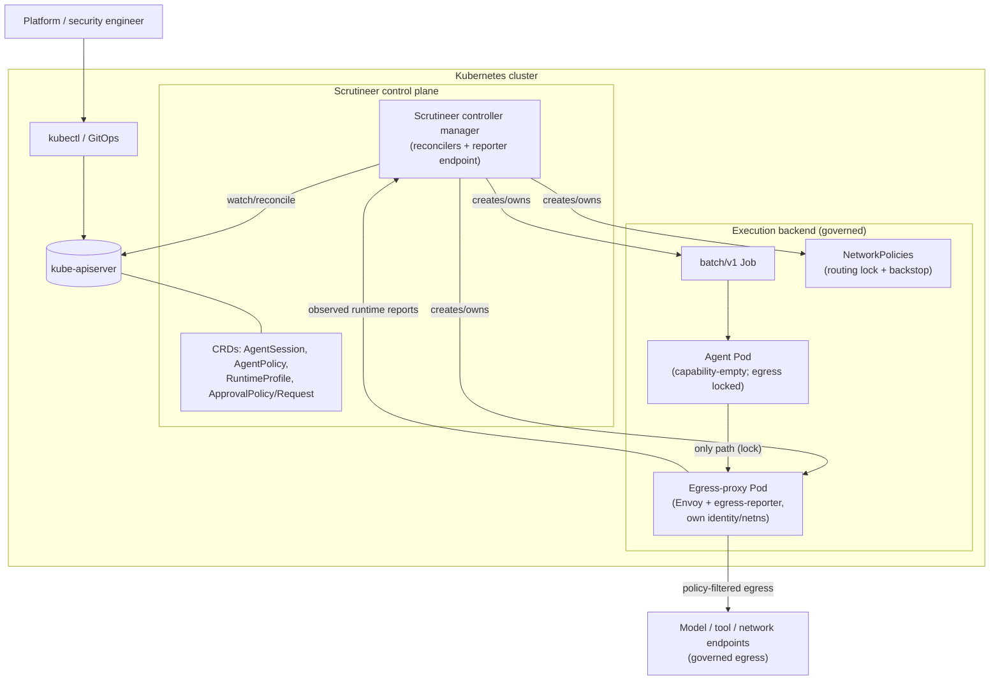
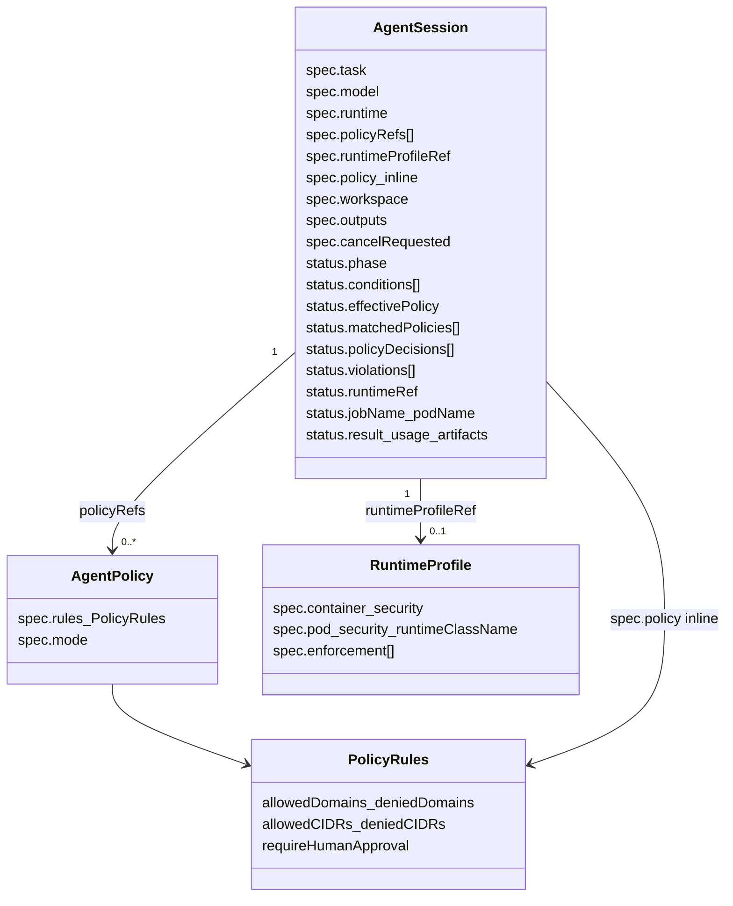
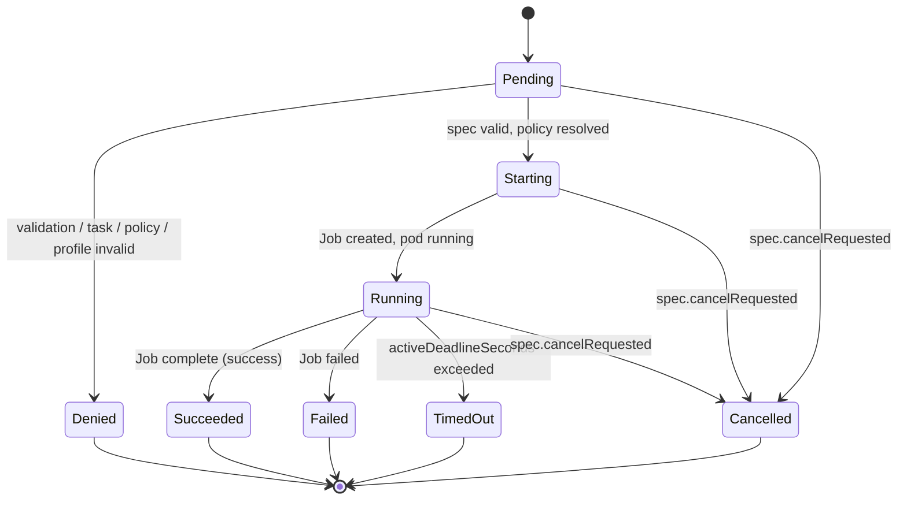
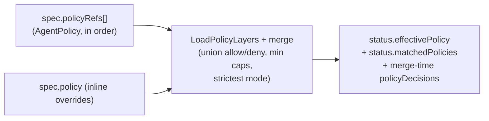
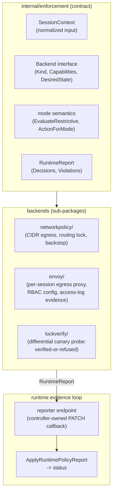

# Scrutineer Architecture & Design

> **Canonical architecture reference for Scrutineer.** Read this before implementing anything non-trivial.
> **Companion docs:** product vision (`dev-agent-rules/scrutineer-product-vision.md`), task state & roadmap ([GitHub Issues](https://github.com/grantbarry29/scrutineer/issues)), workflow rules (`dev-agent-rules/scrutineer-workflow.md`), and the area-specific design docs in this folder.
>
> **Enforcement doctrine (#69–#71):** enforcement is **adversarial-grade only**. The cooperative in-pod sidecar tier was removed; the sole enforcement plane is the per-session out-of-pod Envoy egress proxy + default-deny routing lock, empirically verified by the lock gate (#70) before enforced sessions run. Doctrine and rationale: [`untamperable-enforcement.md`](untamperable-enforcement.md).

This document describes **what Scrutineer is, how it is structured, and the invariants every change must preserve.** It is written to be precise enough that an implementer (human or model) can make a correct change without re-deriving the architecture.

---

## 1. What Scrutineer is (and is not)

Scrutineer is a **Kubernetes-native governance and runtime control plane for autonomous AI agents.** It governs *how* agents run — policy, identity, runtime control, observability, audit — and delegates the *running itself* to an execution backend (today: Kubernetes Jobs).

**Scrutineer is NOT:**

- a workflow engine, task runner, or scheduler (it governs those, it does not replace them);
- a generic agent framework, prompt wrapper, or model SDK;
- a chatbot or conversational product.

**The central question Scrutineer answers** for every agent run: *who authorized it, what it could access, what it actually did, what was blocked, what changed, and how to reproduce/audit the decision.*

### 1.1 Control plane vs. data plane (the most important distinction)

| Plane | Responsibility | Where it lives | Examples |
|-------|----------------|----------------|----------|
| **Control plane** | *Declare* and *propagate* desired governance state; aggregate evidence. | CRDs + controllers (this repo today). | AgentSession reconciler, policy merge, status, conditions, events. |
| **Data plane** | *Enforce* policy and *report* what happened at runtime. | Out-of-pod chokepoint pods, NetworkPolicy, future eBPF/sandboxes. | Per-session Envoy egress proxy + egress-reporter, routing-lock/backstop NetworkPolicies, future tools/arena pods. |

> **Invariant:** controllers declare and propagate; they do not enforce. Enforcement and runtime observation belong to replaceable data-plane backends. Keep this separation in every change.

### 1.2 The four-state policy model

Always distinguish these — conflating them is the most common design error:



- **Declared:** what the policy says (CRDs / inline spec).
- **Propagated:** how that policy reaches the runtime (env vars, rendered Envoy RBAC config, generated NetworkPolicies). *Env vars are a propagation hook, not enforcement.*
- **Enforced:** the data plane actually allows/denies.
- **Observed:** runtime evidence recorded back into status (the **runtime evidence loop** — shipped: egress-reporter → reporter endpoint → status).

---

## 2. System context



Today everything in `cp` and `exec` is in this repo except the agent container image itself (user-provided); the first-party images are the manager and the egress-reporter.

---

## 3. API / CRD model

Scrutineer's API group is `scrutineer.sh`, version `v1alpha1` (`api/v1alpha1/`).



**Reference rules (invariant):** all refs (`policyRefs`, `runtimeProfileRef`, `promptConfigMapRef`) are **same-namespace only** in the MVP. Cross-namespace references are a deliberate future feature, not an oversight.

`PolicyRules` is the **shared** policy shape used by AgentPolicy and inline `spec.policy`, so merge logic is uniform. It now carries only fields with an enforcement or control-plane backend: network rules (Envoy/NetworkPolicy) and `requireHumanApproval` (controller approval gate). The tool/file rule fields and caps — and the `ToolPolicy` CRD — were removed per doctrine #1 (#75, resolving the #71 deviation); they return, likely reshaped, with the tools/arena chokepoints.

---

## 4. AgentSession lifecycle (phase state machine)



**Terminal phases** (`Succeeded`, `Failed`, `Denied`, `TimedOut`, `Cancelled`) are sticky: a terminal session never gets a new Job, and `syncStatusFromJob` must not regress a terminal phase. Conditions (`Validated`, `PolicyResolved`, `PolicyPropagated`, `RuntimeProfileResolved`, `RuntimeCreated`, `Completed`, `Ready`) carry finer-grained state and are merged carefully (see §6.3).

---

## 5. Reconciliation flow

The single reconcile loop (`internal/controller/agentsession/reconciler.go`, `Reconcile`) is **idempotent** and computes one status patch at the end of each pass.

```mermaid
sequenceDiagram
    participant API as kube-apiserver
    participant R as AgentSession reconciler
    participant Job as Job builder
    participant NP as NetworkPolicy backend

    API->>R: AgentSession event (watch)
    R->>R: get session, handle deletion/finalizer
    R->>R: snapshot original (for single end-of-pass patch)
    R->>R: validateSpec -> Denied on failure
    R->>R: resolveTask (prompt / configmap)
    R->>R: resolvePolicy (merge refs + inline -> effectivePolicy, decisions)
    R->>R: resolveRuntimeProfile (optional)
    R->>R: approval gate (AwaitingApproval if a matching ApprovalPolicy applies)
    R->>R: egress lock gate (verified-or-refused; enforced sessions hold at Pending until the CNI is proven to enforce NetworkPolicy)
    alt cancelRequested
        R->>API: delete owned Job, phase=Cancelled
    else terminal phase
        R->>R: skip Job creation
    else active
        R->>NP: ensureEgressProxy (per-session Envoy pod/Service/ConfigMap/SA) + routing-lock/backstop NetworkPolicies
        R->>Job: ensureJob (build/owned-check/replace-on-drift)
        Job-->>R: Job
        R->>R: syncStatusFromJob (phase from Job/Pod)
    end
    R->>API: patchStatusWithEnforcement (merge conditions/decisions/violations)
```

**Key reconcile invariants:**

- Idempotent: re-running with no spec change yields no status change (`equalStatus` guard).
- Owner references on Job + NetworkPolicy so GC is automatic; ownership is verified before adopting a Job (`ErrJobNotOwned` → `Denied`/`JobConflict`).
- Job pod template is **immutable** while active; policy/profile changes on a *pending* Job replace it, on an *active* Job set a `*Drift` condition instead.
- The reconciler uses an uncached `APIReader` where stale reads are dangerous (deletion detection, status pre-read).

**Runtime backends.** Runtime mechanics (create/observe/stop) are not hard-wired to Jobs: the reconciler routes `ensure`/`stop`/`runtimeGone`/`ownedType` through a `runtimeBackend` interface chosen from a registry keyed by `spec.runtime.orchestrator` (`runtime_backend.go`). Two in-tree backends ship today — `kubernetes-job` (default, `batchv1.Job`) and `kubernetes-pod` (a bare `corev1.Pod`, `backend_pod.go`) — both built from the shared `job.BuildPodTemplateSpec` so the data-plane wiring is identical. Backends return a neutral `observation`; the reconciler owns all status mapping. `status.runtimeRef` (`apiVersion`/`kind`/`name`/`uid`) records the runtime object's identity for any backend; `status.jobName` is a deprecated alias of `runtimeRef.name` kept for the Job backend. The diagram above shows the Job path; the Pod path is identical with `Pod` substituted for `Job`.

---

## 6. Policy resolution, propagation, and evidence

### 6.1 Merge / resolution (`internal/policy`)



- **Merge order:** referenced policies in listed order, then inline `spec.policy` overrides.
- **Mode:** strictest of all contributors wins (`audit-only` < `dry-run` < `enforced`).
- List fields are unioned; every merge emits structured `PolicyDecision` entries with `phase=merge`.

### 6.2 Propagation

Effective policy reaches the runtime via:

- **Env vars** on the agent container (`AGENT_POLICY_MODE`, `AGENT_POLICY_DENIED_DOMAINS`, etc.) — a *propagation hook*, not enforcement.
- **NetworkPolicies** — the CIDR egress baseline, plus (when the `envoy` enforcement type is enabled) the agent-pod **routing lock** and the Envoy-pod **backstop**. Dual-stack posture (#66): the egress path is IPv4-only — no rendered policy contains an IPv6 allow, so on dual-stack clusters all v6 egress from locked/backstopped pods is denied by construction (proven by the `make test-e2e-net-dual` suite).
- **Explicit-proxy env** (`HTTP_PROXY`/`HTTPS_PROXY` → the session's Envoy ClusterIP) and the **rendered Envoy RBAC config** (effective FQDN policy → ConfigMap) when a RuntimeProfile enables the `envoy` type.

### 6.3 Status as source of truth & the merge-patch hazard

CRD status subresources do **not** support strategic merge patch. A naive `MergeFrom` replaces whole arrays, dropping condition types / decisions that exist on the apiserver but not in a stale cache read. Therefore `patchStatus`:

1. Unions conditions, runtime decisions, and violations from the reconcile-start snapshot **and** a fresh live read, then
2. `Status().Update`s with optimistic concurrency.

> **Invariant:** any new status list field that can be written by more than one path must have an in-place merge helper and be merged in `patchStatus`, exactly like `conditions`, `policyDecisions`, and `violations`. The runtime reporter is a second writer and must obey the same rule.

### 6.4 Decisions vs. violations

- `status.policyDecisions[]` — audit log of evaluations (`phase` = `merge` | `runtime`; `action` = `allow`/`deny`/`audit`/`dry-run`). Capped at `MaxPolicyDecisions` (64).
- `status.violations[]` — the subset worth flagging: `deny` (enforced) and `dry-run` (would-deny) outcomes. Derived by `enforcement.ViolationsFromDecisions`. Capped at `MaxViolations` (64).

---

## 7. Enforcement architecture & the runtime evidence loop

The `internal/enforcement` package is the **backend-neutral contract** between control plane and data plane.



- **Today (#71):** the sole enforcement plane is the per-session **out-of-pod Envoy egress proxy** + the default-deny **routing lock**, whose enforcement is empirically verified before enforced sessions run (the lock gate, #70). Agent egress is forced through Envoy via `HTTP_PROXY`/`HTTPS_PROXY`; Envoy's access log is tailed by a co-located **egress-reporter** that submits **`observed`** evidence to the **reporter** (`cmd/main.go` → `mgr.Add(reporter.NewRunnable(...))`), which merges it into `status.policyDecisions`(runtime), `status.violations`, `status.usage`, and `status.events`. The cooperative in-pod sidecar tier was **removed** — a control the agent could bypass or starve is advisory, not enforcement.
- **Trust model:** enforcement lives in a trust domain the agent cannot alter (separate pod/identity/netns) and is made mandatory by the CNI-enforced NetworkPolicy lock, so evidence is `observed`. Tool- and file-domain governance await their own out-of-pod chokepoints ([`tools-pod-chokepoint.md`](tools-pod-chokepoint.md), [`arena-workspace.md`](arena-workspace.md)); until then those domains have no policy surface (no unenforced fields).
- **The direction:** isolate the data plane from the agent so integrity no longer depends on its cooperation — per-session identity / scoped ServiceAccount, out-of-pod or kernel/eBPF observation the agent cannot bypass, FQDN egress (Cilium/Envoy), and sandboxed runtimes (gVisor/Kata). See [`runtime-reporter-contract.md`](runtime-reporter-contract.md) for the evidence loop, and the *Runtime evidence integrity* track for the adversarial roadmap.

Detailed designs: [`enforcement-architecture.md`](enforcement-architecture.md) (contract + history), [`evidence-integrity.md`](evidence-integrity.md) (egress chokepoint + trust boundary), [`untamperable-enforcement.md`](untamperable-enforcement.md) (doctrine + lock gate), [`tools-pod-chokepoint.md`](tools-pod-chokepoint.md) / [`arena-workspace.md`](arena-workspace.md) (deferred successors).

---

## 8. Code map

| Path | Responsibility |
|------|----------------|
| `api/v1alpha1/` | CRD Go types + kubebuilder markers (`agentsession_types.go`, `agentpolicy_types.go`, `runtimeprofile_types.go`, `policy_types.go`, approval types). Source of truth for generated CRDs. |
| `internal/controller/agentsession/` | The reconciler and its helpers: `reconciler.go`, `status.go` (patch strategy), `runtime_backend.go` (backend interface + registry + `kubernetes-job`), `backend_pod.go` (`kubernetes-pod`), `policy.go`/`policy_decisions.go`, `violations.go`, `networkpolicy.go`, `egress_envoy.go` (per-session proxy provisioning), `lock_gate.go` (verified-or-refused), `runtimeprofile*.go`, `pod*.go`, watches. |
| `internal/controller/job/` | Pure Job/Pod template construction: `builder.go`, `sidecars.go` (envoy proxy-env wiring), `constants.go` (labels). No cluster I/O. |
| `internal/policy/` | Policy layer loading, merge/resolve, status application. Backend-neutral. |
| `internal/enforcement/` | Enforcement contract + mode semantics + report/violation helpers; sub-packages: `networkpolicy/`, `envoy/`, `lockverify/`, `reporterclient/`, `containerenv/`. |
| `internal/reporter/` | Runtime reporter HTTP endpoint (identity verification, caller-class assurance stamping, approval channel). |
| `cmd/main.go` | Manager setup, flags (incl. `--lock-probe-*`), `SetupWithManager`, health checks. |
| `cmd/egress-reporter/` | The out-of-pod evidence producer beside Envoy (own image). |
| `config/` | Kustomize bases, CRDs (generated), RBAC, samples. |
| `docs/design/` | This folder: architecture + phase design docs. |

**Layering rule:** `internal/controller/job` and `internal/policy` and `internal/enforcement` must not import the `agentsession` controller package (one-way dependency: controller → helpers, never the reverse). `enforcement` depends only on `api/v1alpha1`.

---

## 9. Design principles & invariants (checklist for any change)

1. **Control/data-plane separation** — controllers declare/propagate/aggregate; never enforce inline.
2. **Orchestrator-agnostic** — do not overfit APIs/reconciler to Kubernetes Jobs; keep room for Tekton/Argo/Temporal adapters.
3. **Kubernetes-native discipline** — idempotent reconcile, owner references, status subresource, conditions, events, least-privilege RBAC.
4. **Status is canonical** — runtime evidence lives in `AgentSession.status`; multi-writer fields use the union-merge patch strategy.
5. **Same-namespace refs** — no cross-namespace references in MVP.
6. **Bounded status** — decision/violation lists are capped with truncation summaries; never let status grow unbounded.
7. **Least privilege** — agent pods get no Kubernetes API write access to their own governance record (see reporter contract).
8. **Modes are real semantics** — `audit-only` / `dry-run` / `enforced` change recorded actions and whether the data plane blocks; respect them in any enforcement or reporting code.
9. **Narrow slices** — one capability per change; out-of-scope work becomes a GitHub Issue, not part of the diff.
10. **No speculative architecture** — no new CRDs/sidecars/webhooks/enforcement backends unless the task explicitly calls for them.

---

## 10. Roadmap orientation

Roadmap state lives in GitHub Issues / epics — see <https://github.com/grantbarry29/scrutineer/issues>. Orientation:

**Shipped:**

- MVP foundation and hardening; reusable policy model + RuntimeProfile.
- Enforcement contracts + the NetworkPolicy baseline; the cooperative in-pod slices were removed (#71).
- The runtime evidence loop — reporter endpoint, `status.events[]`, and the egress-reporter as the live `observed` producer.
- Observability & audit export (usage metrics, timeline model, Prometheus, OTel, audit sink, log/artifact collection) — consumes the evidence loop.
- Scoped human approval workflows (ApprovalPolicy / ApprovalRequest + the gate/resume state machine).
- Orchestrator-agnostic runtime backends: the `runtimeBackend` interface + `status.runtimeRef`, with two in-tree backends (`kubernetes-job`, `kubernetes-pod`).

**Open / in progress:**

- **Adversarial-grade-only enforcement (epic #69):** the doctrine, verified-or-refused lock gate (#70), and cooperative-tier removal (#71) shipped; remaining hardening + the deferred tools/arena chokepoints are tracked under the epic.
- **External orchestrator adapters (epic #10):** adapter design (Tekton/Argo/Temporal) + SessionTemplate.
- **Artifact export (#117–#120):** pluggable object-store export for collected session outputs.

**Ahead:**

- **Operational UI (epic #11, deferred nice-to-have):** governance/observability dashboard, not a chatbot — see [`operational-ui.md`](operational-ui.md).
- **Enterprise platform (epic #13):** per-session identity, CredentialProfile, multi-tenancy, HA, sandboxes.

> When in doubt about where a piece of work belongs, map it to the four-state policy model (§1.2) and the control/data-plane split (§1.1), then place it under the epic whose scope it matches without violating an invariant in §9.
