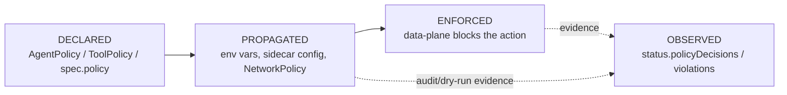
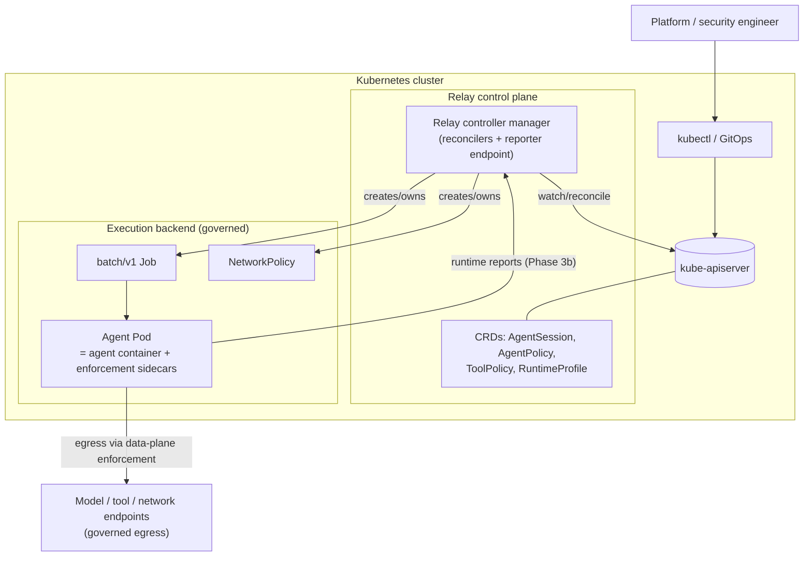
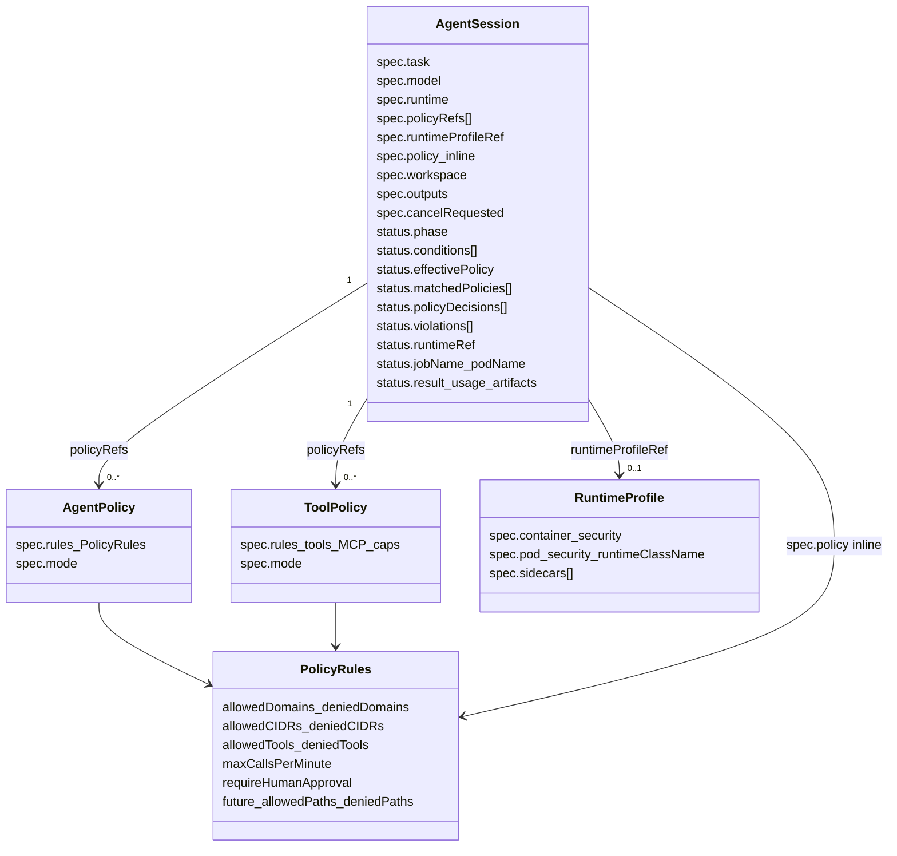
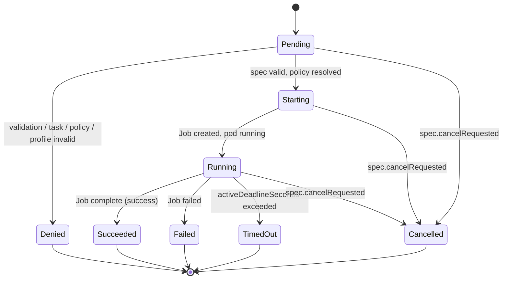
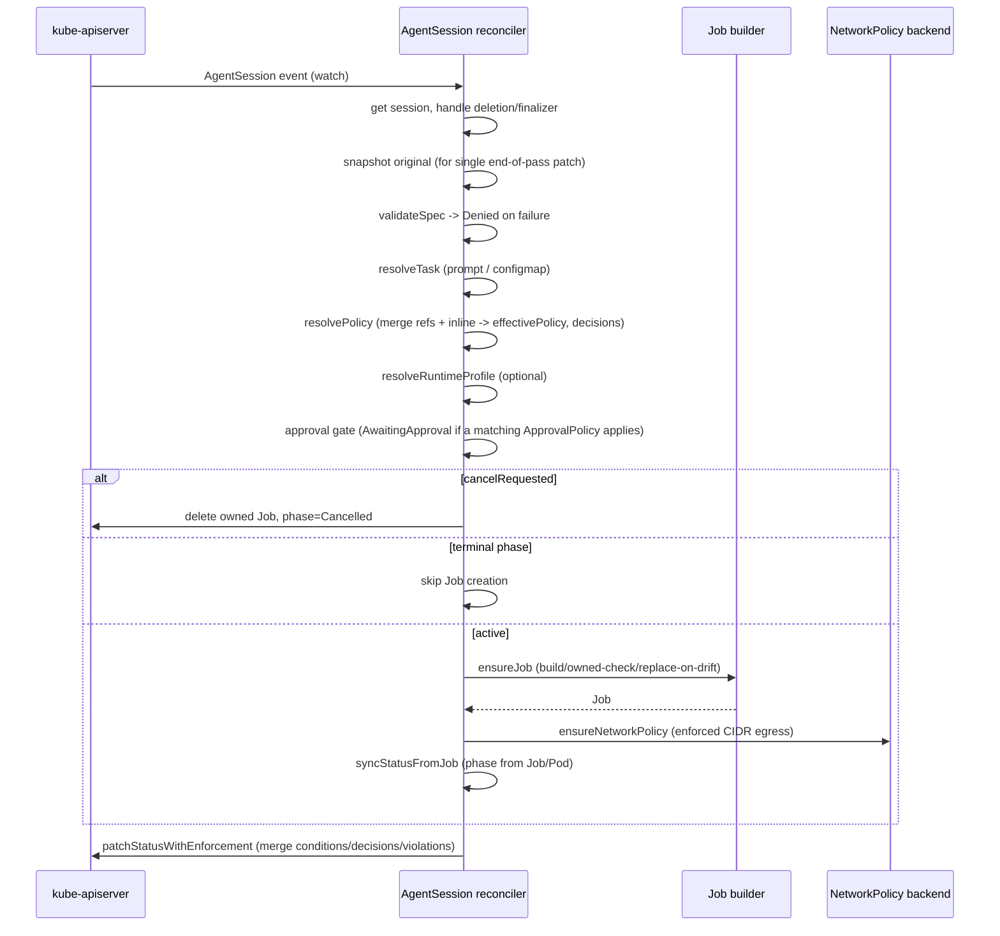
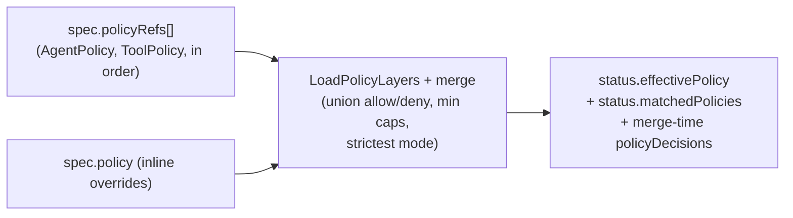
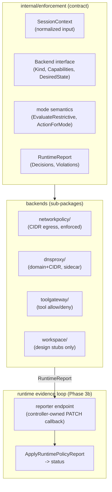

# Relay Architecture & Design

> **Canonical architecture reference for Relay.** Read this before implementing anything non-trivial.
> **Companion docs:** product vision (`.cursor/rules/relay-product-vision.mdc`), task state & roadmap ([GitHub Issues](https://github.com/grantbarry29/Relay/issues)), workflow rules (`.cursor/relay-cursor-workflow.md`), and the phase-specific design docs in this folder.

This document describes **what Relay is, how it is structured, and the invariants every change must preserve.** It is written to be precise enough that an implementer (human or model) can make a correct change without re-deriving the architecture.

---

## 1. What Relay is (and is not)

Relay is a **Kubernetes-native governance and runtime control plane for autonomous AI agents.** It governs *how* agents run — policy, identity, runtime control, observability, audit — and delegates the *running itself* to an execution backend (today: Kubernetes Jobs).

**Relay is NOT:**

- a workflow engine, task runner, or scheduler (it governs those, it does not replace them);
- a generic agent framework, prompt wrapper, or model SDK;
- a chatbot or conversational product.

**The central question Relay answers** for every agent run: *who authorized it, what it could access, what it actually did, what was blocked, what changed, and how to reproduce/audit the decision.*

### 1.1 Control plane vs. data plane (the most important distinction)

| Plane | Responsibility | Where it lives | Examples |
|-------|----------------|----------------|----------|
| **Control plane** | *Declare* and *propagate* desired governance state; aggregate evidence. | CRDs + controllers (this repo today). | AgentSession reconciler, policy merge, status, conditions, events. |
| **Data plane** | *Enforce* policy and *report* what happened at runtime. | Sidecars, gateways, NetworkPolicy, future eBPF/sandboxes. | dns-proxy, tool-gateway, NetworkPolicy egress, future Envoy/Cilium. |

> **Invariant:** controllers declare and propagate; they do not enforce. Enforcement and runtime observation belong to replaceable data-plane backends. Keep this separation in every change.

### 1.2 The four-state policy model

Always distinguish these — conflating them is the most common design error:

- **Declared:** what the policy says (CRDs / inline spec).
- **Propagated:** how that policy reaches the runtime (env vars, sidecar config, generated NetworkPolicy). *Env vars are a propagation hook, not enforcement.*
- **Enforced:** the data plane actually allows/denies.
- **Observed:** runtime evidence recorded back into status (the **runtime evidence loop**, Phase 3b — currently the active gap).

---

## 2. System context

Today everything in `cp` and `exec` is in this repo except the agent container image itself (user-provided) and the not-yet-built first-party sidecar images.

---

## 3. API / CRD model

Relay's API group is `relay.secureai.dev`, version `v1alpha1` (`api/v1alpha1/`).

**Reference rules (invariant):** all refs (`policyRefs`, `runtimeProfileRef`, `promptConfigMapRef`) are **same-namespace only** in the MVP. Cross-namespace references are a deliberate future feature, not an oversight.

`PolicyRules` is the **shared** policy shape used by AgentPolicy, ToolPolicy, and inline `spec.policy`, so merge logic is uniform.

---

## 4. AgentSession lifecycle (phase state machine)

**Terminal phases** (`Succeeded`, `Failed`, `Denied`, `TimedOut`, `Cancelled`) are sticky: a terminal session never gets a new Job, and `syncStatusFromJob` must not regress a terminal phase. Conditions (`Validated`, `PolicyResolved`, `PolicyPropagated`, `RuntimeProfileResolved`, `RuntimeCreated`, `Completed`, `Ready`) carry finer-grained state and are merged carefully (see §6.3).

---

## 5. Reconciliation flow

The single reconcile loop (`internal/controller/agentsession/reconciler.go`, `Reconcile`) is **idempotent** and computes one status patch at the end of each pass.

**Key reconcile invariants:**

- Idempotent: re-running with no spec change yields no status change (`equalStatus` guard).
- Owner references on Job + NetworkPolicy so GC is automatic; ownership is verified before adopting a Job (`ErrJobNotOwned` → `Denied`/`JobConflict`).
- Job pod template is **immutable** while active; policy/profile changes on a *pending* Job replace it, on an *active* Job set a `*Drift` condition instead.
- The reconciler uses an uncached `APIReader` where stale reads are dangerous (deletion detection, status pre-read).

**Runtime backends (Phase 6).** Runtime mechanics (create/observe/stop) are not hard-wired to Jobs: the reconciler routes `ensure`/`stop`/`runtimeGone`/`ownedType` through a `runtimeBackend` interface chosen from a registry keyed by `spec.runtime.orchestrator` (`runtime_backend.go`). Two in-tree backends ship today — `kubernetes-job` (default, `batchv1.Job`) and `kubernetes-pod` (a bare `corev1.Pod`, `backend_pod.go`) — both built from the shared `job.BuildPodTemplateSpec` so the data-plane/sidecar wiring is identical. Backends return a neutral `observation`; the reconciler owns all status mapping. `status.runtimeRef` (`apiVersion`/`kind`/`name`/`uid`) records the runtime object's identity for any backend; `status.jobName` is a deprecated alias of `runtimeRef.name` kept for the Job backend. The diagram above shows the Job path; the Pod path is identical with `Pod` substituted for `Job`.

---

## 6. Policy resolution, propagation, and evidence

### 6.1 Merge / resolution (`internal/policy`)

- **Merge order:** referenced policies in listed order, then inline `spec.policy` overrides.
- **Mode:** strictest of all contributors wins (`audit-only` < `dry-run` < `enforced`).
- **Caps** (e.g. `maxCallsPerMinute`): minimum across contributors.
- Every merge emits structured `PolicyDecision` entries with `phase=merge`.

### 6.2 Propagation

Effective policy reaches the runtime via:

- **Env vars** on the agent container (`AGENT_POLICY_MODE`, `AGENT_POLICY_MAX_TOOL_CALLS_PER_MINUTE`, etc.) — a *propagation hook*, not enforcement.
- **NetworkPolicy** (enforced mode, CIDR egress) — real but coarse; FQDN not covered.
- **Sidecar config** (env on injected `dns-proxy`/`tool-gateway`/`envoy` sidecars) when a RuntimeProfile enables them.

### 6.3 Status as source of truth & the merge-patch hazard

CRD status subresources do **not** support strategic merge patch. A naive `MergeFrom` replaces whole arrays, dropping condition types / decisions that exist on the apiserver but not in a stale cache read. Therefore `patchStatus`:

1. Unions conditions, runtime decisions, and violations from the reconcile-start snapshot **and** a fresh live read, then
2. `Status().Update`s with optimistic concurrency.

> **Invariant:** any new status list field that can be written by more than one path must have an in-place merge helper and be merged in `patchStatus`, exactly like `conditions`, `policyDecisions`, and `violations`. The runtime reporter (Phase 3b) is a second writer and must obey the same rule.

### 6.4 Decisions vs. violations

- `status.policyDecisions[]` — audit log of evaluations (`phase` = `merge` | `runtime`; `action` = `allow`/`deny`/`audit`/`dry-run`). Capped at `MaxPolicyDecisions` (64).
- `status.violations[]` — the subset worth flagging: `deny` (enforced) and `dry-run` (would-deny) outcomes. Derived by `enforcement.ViolationsFromDecisions`. Capped at `MaxViolations` (64).

---

## 7. Enforcement architecture (Phase 3) & the runtime evidence loop (Phase 3b)

The `internal/enforcement` package is the **backend-neutral contract** between control plane and data plane.

- **Today:** the contract, mode semantics, and a NetworkPolicy backend (real, kernel-enforced) are in place. The **dns-proxy**, **tool-gateway**, and **fs-gateway** sidecars ship **first-party images** running real cooperative enforcement (`EvaluateEgress` / `EvaluateTool` / `EvaluateFile`; the agent's `HTTP_PROXY`/`HTTPS_PROXY` is pointed at dns-proxy). The **reporter** runs live in the manager (`cmd/main.go` → `mgr.Add(reporter.NewRunnable(...))`) and merges runtime evidence reported by those sidecars into `status.policyDecisions`(runtime), `status.violations`, `status.usage`, and `status.events`. Only the **envoy** sidecar remains a placeholder (busybox) image.
- **The gap (cooperative → adversarial):** enforcement and reporting are **cooperative** — the sidecars share the agent's pod and ServiceAccount, so a fully compromised agent could bypass a gateway or tamper with/starve the data plane. Runtime evidence is therefore stamped `self-reported`; NetworkPolicy is the one control enforced independently of the agent (kernel).
- **The direction:** isolate the data plane from the agent so integrity no longer depends on its cooperation — per-session identity / scoped ServiceAccount, out-of-pod or kernel/eBPF observation the agent cannot bypass, FQDN egress (Cilium/Envoy), and sandboxed runtimes (gVisor/Kata). See [`phase-3-runtime-reporter-contract.md`](phase-3-runtime-reporter-contract.md) for the evidence loop, and the *Runtime evidence integrity* track for the adversarial roadmap.

Detailed per-backend designs: [`phase-3-enforcement-architecture.md`](phase-3-enforcement-architecture.md), [`phase-3-dns-proxy-prototype.md`](phase-3-dns-proxy-prototype.md), [`phase-3-tool-gateway-contract.md`](phase-3-tool-gateway-contract.md), [`phase-3-file-workspace-policy.md`](phase-3-file-workspace-policy.md).

---

## 8. Code map

| Path | Responsibility |
|------|----------------|
| `api/v1alpha1/` | CRD Go types + kubebuilder markers (`agentsession_types.go`, `agentpolicy_types.go`, `toolpolicy_types.go`, `runtimeprofile_types.go`, `policy_types.go`). Source of truth for generated CRDs. |
| `internal/controller/agentsession/` | The reconciler and its helpers: `reconciler.go`, `status.go` (patch strategy), `runtime_backend.go` (backend interface + registry + `kubernetes-job`), `backend_pod.go` (`kubernetes-pod`), `policy.go`/`policy_decisions.go`, `violations.go`, `networkpolicy.go`, `egress_proxy.go`, `runtimeprofile*.go`, `pod*.go`, watches. |
| `internal/controller/job/` | Pure Job/Pod template construction: `builder.go`, `sidecars.go`, `constants.go` (labels). No cluster I/O. |
| `internal/policy/` | Policy layer loading, merge/resolve, status application. Backend-neutral. |
| `internal/enforcement/` | Enforcement contract + mode semantics + report/violation helpers; sub-packages per backend (`networkpolicy/`, `dnsproxy/`, `toolgateway/`, `workspace/`). |
| `internal/reporter/` | **(Phase 3b slice 2, not yet created)** runtime reporter HTTP endpoint. |
| `cmd/main.go` | Manager setup, flags, `SetupWithManager`, health checks. |
| `config/` | Kustomize bases, CRDs (generated), RBAC, samples. |
| `docs/design/` | This folder: architecture + phase design docs. |

**Layering rule:** `internal/controller/job` and `internal/policy` and `internal/enforcement` must not import the `agentsession` controller package (one-way dependency: controller → helpers, never the reverse). `enforcement` depends only on `api/v1alpha1`.

---

## 9. Design principles & invariants (checklist for any change)

1. **Control/data-plane separation** — controllers declare/propagate/aggregate; never enforce inline.
2. **Orchestrator-agnostic** — do not overfit APIs/reconciler to Kubernetes Jobs; keep room for Tekton/Argo/Temporal adapters (Phase 6).
3. **Kubernetes-native discipline** — idempotent reconcile, owner references, status subresource, conditions, events, least-privilege RBAC.
4. **Status is canonical** — runtime evidence lives in `AgentSession.status`; multi-writer fields use the union-merge patch strategy.
5. **Same-namespace refs** — no cross-namespace references in MVP.
6. **Bounded status** — decision/violation lists are capped with truncation summaries; never let status grow unbounded.
7. **Least privilege** — agent pods get no Kubernetes API write access to their own governance record (see reporter contract).
8. **Modes are real semantics** — `audit-only` / `dry-run` / `enforced` change recorded actions and whether the data plane blocks; respect them in any enforcement or reporting code.
9. **Narrow slices** — one capability per change; out-of-scope work becomes a GitHub Issue, not part of the diff.
10. **No speculative architecture** — no new CRDs/sidecars/webhooks/enforcement backends unless the task explicitly calls for them.

---

## 10. Roadmap orientation

Phases (tracked as GitHub Issues / epics — see <https://github.com/grantbarry29/Relay/issues>):

- **0–2 (done):** MVP foundation, MVP hardening, reusable policy model + RuntimeProfile.
- **3 (contracts done):** data-plane enforcement contracts, NetworkPolicy baseline, sidecar injection, gateway/proxy/file design.
- **3b (active — critical path):** runtime evidence loop (reporter → events → real images → violations → file impl).
- **4:** observability & audit (usage metrics, timeline model, Prometheus, OTel, audit sink, log/artifact collection) — consumes the evidence loop.
- **5:** scoped human approval workflows.
- **6 (in progress):** orchestrator-agnostic runtime backends. `runtimeBackend` interface + `status.runtimeRef` shipped; two in-tree backends (`kubernetes-job`, `kubernetes-pod`) done. Next: external adapter design (Tekton/Argo/Temporal) + SessionTemplate.
- **7:** operational UI (governance/observability dashboard, not a chatbot).
- **8:** enterprise platform (per-session identity, CredentialProfile, multi-tenancy, HA, sandboxes).

> When in doubt about where a piece of work belongs, map it to the four-state policy model (§1.2) and the control/data-plane split (§1.1), then place it in the earliest phase that does not violate an invariant in §9.
