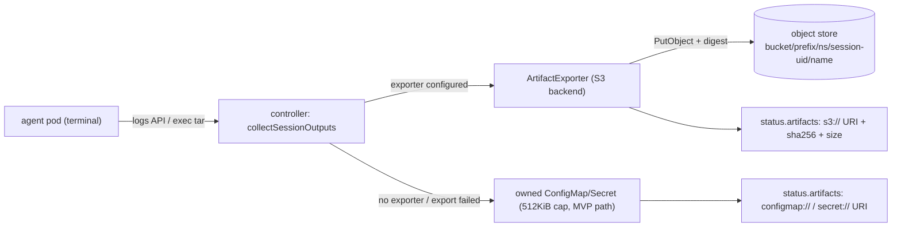

# Artifact Export — Durable Object-Store Retention for Session Outputs

**Status:** design — approved direction, not yet implemented. Tracking: #2.
**Scope:** a pluggable export backend that uploads collected session outputs (logs, workspace bundles) to durable object storage (S3 and S3-compatible: MinIO, R2, GCS interop), recording `s3://…` URIs — plus content digests — in `status.artifacts`. Extends the in-cluster collection MVP (`internal/controller/agentsession/outputs.go`); does not replace it.
**Non-goals:** log *streaming* / observability pipelines (that is OTLP export, [`phase-4-observability-export.md`](phase-4-observability-export.md)); exporting evidence/status/audit records (the OTLP audit sink owns that); artifact scanning or DLP; controller-managed bucket lifecycle, retention, or deletion (bucket policy owns retention); workspace *governance* (that is the arena track, [`arena-workspace.md`](arena-workspace.md)).

---

## Why this exists

The collection MVP stores outputs in owned ConfigMaps/Secrets (`configmap://` / `secret://` URIs) with hard 512KiB caps. That is deliberately etcd-sized and session-scoped — three properties that are wrong for retention:

1. **Capacity:** anything past 512KiB is silently truncated. Real workspace bundles routinely exceed it.
2. **Lifetime:** the artifacts are owner-referenced to the AgentSession — deleting the session garbage-collects the evidence of what it produced. Enterprise retention/forensics needs artifacts to *outlive* the session object.
3. **Tamper-evidence:** a ConfigMap is mutable by anyone with namespace RBAC; nothing detects post-hoc edits. Governance artifacts should at minimum be tamper-evident.

## Shape



- **Exporter interface** (new package, `internal/controller/agentsession/export` or `internal/export`):

  ```go
  type ArtifactExporter interface {
      // Export uploads one artifact and returns its durable URI.
      // Called only after collection succeeds; must be idempotent per key.
      Export(ctx context.Context, key ObjectKey, mediaType string, r io.Reader) (uri string, sha256hex string, size int64, err error)
  }
  ```

  The reconciler's collection path stays the single orchestration point: collect → export if configured → fall back to the in-cluster path if not (or if export fails). Collection remains once-per-artifact-name, terminal-phase-only, idempotent.

- **Object layout:** `s3://<bucket>/<prefix>/<namespace>/<session-UID>/<artifact-name>` — session **UID**, not name, so a recreated same-name session can never overwrite a prior session's artifacts.

- **Configuration is operator-level, not per-session.** The destination (endpoint, bucket, prefix, credentials) is cluster infrastructure: controller flags/env (`--artifact-export-endpoint`, `--artifact-export-bucket`, …) with credentials from a mounted Secret **or ambient identity** (IRSA / workload identity — support credential-less config). Sessions do not choose buckets; `spec.outputs` continues to say only *what* to collect. Unset endpoint = exporter disabled = MVP behavior, unchanged.

- **Caps lift on the export path.** The 512KiB caps exist because the store is etcd. Exported artifacts stream (exec stdout → upload, no full in-memory buffer) up to a much larger operator-configured cap (default on the order of 100MiB); truncation at that cap is recorded in the artifact ref, never silent. The in-cluster fallback keeps its 512KiB caps.

- **Integrity:** the exporter computes sha256 + size during upload and the controller records them in `ArtifactRef` (new optional `digest`/`sizeBytes` fields — controller-computed, so within doctrine: they carry `controller`-grade trust, and `status` is writable only via the status subresource). The status digest makes the stored object tamper-evident relative to status. Optional bucket object-lock/WORM is the operator's escalation, not ours.

- **Failure semantics — degrade to *present but capped*, never lost, never false.** Export failure must not fail the session, block the terminal phase, or lose the artifact: fall back to the in-cluster capped copy, emit a warning event + session event. The `s3://` URI is written to status **only after** the upload succeeds (verified write; digest computed from the bytes actually sent). A URI in status means the object existed with that digest at write time.

- **Retention/GC:** exported objects intentionally outlive the session — the controller **never deletes** from the bucket (audit posture; lifecycle is bucket policy). Session deletion still GCs the in-cluster copies as today.

- **First backend: S3-compatible** via a single client that covers AWS S3, MinIO, R2 (recommendation: `minio-go` for dependency weight; `aws-sdk-go-v2` acceptable if IRSA ergonomics demand it — decide at implementation). Integration test against MinIO (or a mock S3) per #2's verification note.

## Slicing (child issues of #2 when scheduled)

1. Exporter interface + S3 backend + controller flags; export replaces in-cluster storage for successfully exported artifacts; fallback intact → `make test` + MinIO integration test.
2. `ArtifactRef.digest`/`sizeBytes` API fields + `make manifests`; recorded on both paths (export always; in-cluster cheaply since bytes are in hand) → `make test`.
3. Streaming collection (exec stdout → upload) + configurable export cap + truncation marking → integration test with >512KiB artifact.

## Honest boundaries (state, don't hide)

- **Artifact *content* is agent-authored.** Logs are what the agent printed; the workspace bundle is what the agent wrote, tarred by an exec *in the agent's own container* (agent-controlled filesystem and `tar` binary). Export integrity (digest, durability) starts at collection time — it authenticates *what was collected*, not what the agent did earlier. This is retention infrastructure, **not** `observed`-assurance evidence; do not present it as enforcement.
- The controller needs only `PutObject`-equivalent permission on the prefix; grant nothing wider. Bucket security (encryption, access policy, object lock) is the operator's.
- Credentials: static Secret or ambient identity now; alignment with CredentialProfile (#25) when that design lands — noted, not blocked on it.

## Open questions (answer at implementation)

1. Keep a small in-cluster copy *in addition to* the exported object for quick `kubectl` access, or is the URI enough? (Lean: URI only — one source of truth.)
2. Should `agent-logs` export the *full* log (re-request without `LimitBytes`) or the same capped read? (Lean: full, under the export cap.)
3. Per-artifact media-type-specific keys/extensions (`agent.log`, `artifacts.tar.gz`) vs. bare artifact names in the object key.
