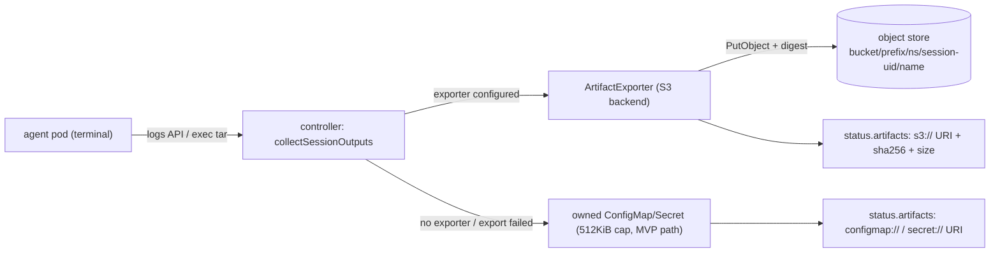

# Artifact Export — Durable Object-Store Retention for Session Outputs

**Scope:** a pluggable export backend that uploads collected session outputs (logs, workspace bundles) to durable object storage (S3 and S3-compatible: MinIO, R2, GCS interop), recording `s3://…` URIs — plus content digests — in `status.artifacts`. Extends the in-cluster collection MVP (`internal/controller/agentsession/outputs.go`); does not replace it.
**Non-goals:** log *streaming* / observability pipelines (that is OTLP export, [`phase-4-observability-export.md`](phase-4-observability-export.md)); exporting evidence/status/audit records (the OTLP audit sink owns that today — but see *Relation to evidence export* below: the exporter plumbing is deliberately reusable for a future evidence slice); artifact scanning or DLP; controller-managed bucket lifecycle, retention, or deletion (bucket policy owns retention); workspace *governance* (that is the arena track, [`arena-workspace.md`](arena-workspace.md)).

---

## Why this exists

The collection MVP stores outputs in owned ConfigMaps/Secrets (`configmap://` / `secret://` URIs) with hard 512KiB caps. That is deliberately etcd-sized and session-scoped — three properties that are wrong for retention:

1. **Capacity:** anything past 512KiB is silently truncated. Real workspace bundles routinely exceed it. Worse for logs: the cap is applied via `LimitBytes` on the pod-logs API, which keeps the **first** 512KiB — a long session's capped log is its *head*, so the most recent (usually most diagnostic) output is exactly what's lost.
2. **Lifetime:** the artifacts are owner-referenced to the AgentSession — deleting the session garbage-collects the evidence of what it produced. Enterprise retention/forensics needs artifacts to *outlive* the session object.
3. **Tamper-evidence:** a ConfigMap is mutable by anyone with namespace RBAC; nothing detects post-hoc edits. Governance artifacts should at minimum be tamper-evident.

## Shape



- **Exporter interface** (new package: `internal/export` — decided; see *Relation to evidence export*):

  ```go
  type ArtifactExporter interface {
      // Export uploads one artifact and returns its durable URI.
      // Called only after collection succeeds; must be idempotent per key.
      Export(ctx context.Context, key ObjectKey, mediaType string, r io.Reader) (uri string, sha256hex string, size int64, err error)
  }
  ```

  The reconciler's collection path stays the single orchestration point: collect → export if configured → fall back to the in-cluster path if not (or if export fails). Collection remains once-per-artifact-name, terminal-phase-only, idempotent.

- **Object layout:** `s3://<bucket>/<prefix>/<namespace>/<session-UID>/<artifact-name>` — session **UID**, not name, so a recreated same-name session can never overwrite a prior session's artifacts.

- **Configuration is operator-level, not per-session.** The destination (endpoint, bucket, prefix, credentials) is cluster infrastructure: controller flags/env (`--artifact-export-endpoint`, `--artifact-export-bucket`, …) with credentials from a mounted Secret **or ambient identity** (IRSA / workload identity — support credential-less config). Sessions do not choose buckets; `spec.outputs` continues to say only *what* to collect. Unset endpoint = exporter disabled = MVP behavior, unchanged.

- **Caps lift on the export path.** The 512KiB caps exist because the store is etcd. Exported artifacts stream (exec stdout → upload, no full in-memory buffer) up to a much larger operator-configured cap (default on the order of 100MiB); truncation at that cap is recorded in the artifact ref, never silent. The in-cluster fallback keeps its 512KiB caps.

- **Integrity:** the exporter computes sha256 + size during upload and the controller records them in `ArtifactRef` (new optional `digest`/`sizeBytes` fields — controller-computed, so within doctrine: they carry `controller`-grade trust, and `status` is writable only via the status subresource). The status digest makes the stored object tamper-evident relative to status. Optional bucket object-lock/WORM is the operator's escalation, not ours.

- **Failure semantics — degrade to *present but capped*, never lost, never false.** Export failure must not fail the session, block the terminal phase, or lose the artifact: fall back to the in-cluster capped copy, emit a warning event + session event. This extends the posture the collection path already has (a `collectSessionOutputs` error is a Warning event, `EventReasonOutputsCollectionFailed`; the reconcile continues). The `s3://` URI is written to status **only after** the upload succeeds (verified write; digest computed from the bytes actually sent). A URI in status means the object existed with that digest at write time.
  **The degrade is permanent per artifact:** once the fallback `configmap://`/`secret://` ref is recorded, the once-per-artifact-name gate (`hasArtifactNamed`) means export is never retried for it. That is deliberate — the session is terminal, there is no requeue driver to ride, and an operator who cares can re-run collection out of band. The warning event is the record that a capped copy exists where an exported object was intended.

- **Retention/GC:** exported objects intentionally outlive the session — the controller **never deletes** from the bucket (audit posture; lifecycle is bucket policy). Session deletion still GCs the in-cluster copies as today.

- **First backend: S3-compatible** via a single client that covers AWS S3, MinIO, R2 (recommendation: `minio-go` for dependency weight; `aws-sdk-go-v2` acceptable if IRSA ergonomics demand it — decide at implementation). Integration test against MinIO (or a mock S3) per #2's verification note.

## Relation to evidence export (long-running agents)

[`long-running-agents.md`](long-running-agents.md) names #2 "the no-regrets first brick" of its Tier 1: at long horizons the capped `status` evidence lists become a rolling sample, and the fix is durable export with `status` holding a window plus a pointer. That does **not** widen this design's scope — evidence export has its own semantics (assurance labeling, ordering, dedup keys) and stays a separate future slice. What it *does* decide is placement and reusability:

- The exporter lives at **`internal/export`**, not under `internal/controller/agentsession/` — the object-store client, operator-level configuration, credential handling, and key-layout conventions are shared plumbing that an evidence-export slice reuses as-is.
- The interface stays content-agnostic (`key + mediaType + io.Reader`), so "a batch of evidence records" is just another object; nothing artifact-specific leaks into the transport.
- Evidence written through this plumbing would still be labeled at its source's assurance level — the exporter adds durability and a digest, never trust.

## Slicing (child issues of #2)

Filed in the order they should land (API shape → reconciler behavior → lifted limits → cluster proof), per the workflow decomposition rules; each stands alone:

1. **#117 — `ArtifactRef.digest`/`sizeBytes` API fields** (+ `make manifests`): optional, controller-computed; recorded by the in-cluster path immediately (bytes are in hand). Smallest slice, unblocks the rest → `make test`.
2. **#118 — `internal/export`: exporter interface + S3 backend + manager config + reconciler wiring**: export replaces in-cluster storage for successfully exported artifacts; fallback + warning event on failure; URIs/digests in status → `make test` (S3 stub via httptest; client library decided here — lean `minio-go` for dependency weight, `aws-sdk-go-v2` acceptable if IRSA ergonomics demand it).
3. **#119 — streaming collection + lifted export cap + truncation marking**: exec/logs stream straight to the uploader (no full in-memory buffer), full log re-requested without `LimitBytes`, operator-configured cap (default ~100MiB), truncation recorded on the ref, mid-stream source failure aborts the upload (no object, fall back) → `make test` with a >512KiB artifact.
4. **#120 — e2e: MinIO-backed export in kind**: MinIO deployed in the e2e cluster, manager configured against it, a real session's exported object fetched and its digest checked against `status.artifacts` → `make test-e2e`.
5. **#122 — quickstart demo**: MinIO as its own pod + Service in the quickstart cluster, exporter configured, a demo session's exported artifact fetched and digest-verified by hand — the guide shows the commonly-used configuration working, not just its flags → `make quickstart && make demo`.

Related coverage gap found during this investigation (independent of #2): the MVP collection paths themselves have no path-level tests — #121.

## Honest boundaries (state, don't hide)

- **Artifact *content* is agent-authored.** Logs are what the agent printed; the workspace bundle is what the agent wrote, tarred by an exec *in the agent's own container* (agent-controlled filesystem and `tar` binary). Export integrity (digest, durability) starts at collection time — it authenticates *what was collected*, not what the agent did earlier. This is retention infrastructure, **not** `observed`-assurance evidence; do not present it as enforcement.
- The controller needs only `PutObject`-equivalent permission on the prefix; grant nothing wider. Bucket security (encryption, access policy, object lock) is the operator's.
- Credentials: static Secret or ambient identity now; alignment with CredentialProfile (#25) when that design lands — noted, not blocked on it.

## Decided (was: open questions)

1. **URI only** — no small in-cluster copy alongside the exported object. One source of truth; the fallback path exists precisely for when the URI can't.
2. **Full log on export** — re-request without `LimitBytes`, bounded by the export cap. Decisive fact: the capped copy is the log's *head* (see Why #1), so a long session's capped copy loses the tail where failures live. The export cap truncates the head too (keep semantics identical), but at ~100MiB instead of 512KiB.

## Open questions (answer at implementation)

1. Per-artifact media-type-specific keys/extensions (`agent.log`, `artifacts.tar.gz`) vs. bare artifact names in the object key. (Slice-3 detail; lean extensions, matching today's ConfigMap/Secret key names.)
