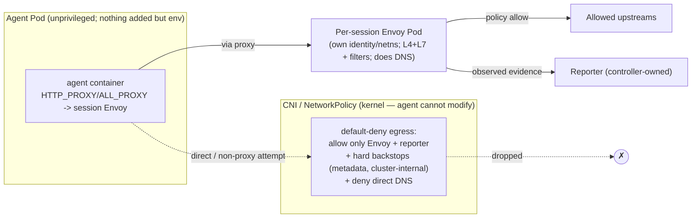

# Evidence Integrity — Per-Session Egress Chokepoint (Envoy)

**Status:** design (no code yet)
**Scope:** the remaining hardening of runtime-evidence integrity — moving egress governance from *cooperative* to *adversarial-grade* (`observed`) by routing all agent egress through a per-session **Envoy** proxy that lives outside the agent's trust domain and cannot be bypassed. **Interim routing mechanism: explicit proxy** (portable, zero cluster dependency). **Transparent interception is a separate future epic** ([#64](https://github.com/grantbarry29/scrutineer/issues/64)).
**Non-goals:** transparent redirect / node data-plane now (future epic #64); a hard Cilium/CNI dependency as the baseline (optional backend only); full eBPF/syscall/file observation; node-compromise defense (see Assumptions); rich FQDN policy content (that is [#32](https://github.com/grantbarry29/scrutineer/issues/32), realized *at* this Envoy).
**Tracking:** [#8](https://github.com/grantbarry29/scrutineer/issues/8) (slices 1–3 shipped; this doc covers the remaining "independent `observed` source" hardening).

---

## 1. The crux

Scrutineer is only trustworthy if **the agent it governs cannot forge or suppress the evidence of what it did.** Everything else — audit, observability, the UI's credibility — leans on this.

Today's egress governance is **cooperative**: the `dns-proxy` runs as a sidecar *inside the agent pod*, sharing its network namespace and (historically) ServiceAccount, reached via `HTTP_PROXY`. A compromised or prompt-injected agent can **bypass** it (raw socket to anywhere), **tamper/starve** it (adjacent process), or **forge** evidence (`self-reported` from within its own trust domain).

Slices 1–3 (shipped) made this *honest and least-privilege* (`EvidenceAssurance` enum, `self-reported` stamping, SA-token isolation, audit assurance) but do not close the bypass/tamper gap. This doc does.

## 2. Principle

> Integrity never comes from *which tool* we use. It comes from the enforcement/observation point living in a **trust domain the agent has no privilege to alter**, and from making that point the **only path** for the governed traffic.

Two properties, both required: **out of the agent's control** (separate pod, own identity/netns) and **mandatory** (the agent's *only* working egress path, enforced by a layer it can't modify).

## 3. Architecture

All agent egress is forced through a **per-session Envoy proxy** running as its **own pod** — own ServiceAccount/identity/netns — created and owner-referenced by the controller and torn down with the session. Envoy handles **both L4 (TCP) and L7 (HTTP / TLS-SNI)** in one filter chain that future L4 features (IDS, packet capture, per-flow metrics) extend — none of which a `NetworkPolicy` could ever host.

**Placement is behind an interface.** Per-session is the first implementation (trivial attribution, tightest blast radius, no control-plane machinery). The same trust model + Envoy config generation can later back a shared per-node gateway for scale, without changing the guarantee.

**Routing enforcement is behind a backend interface.** Interim baseline = **explicit proxy**:
- The controller injects `HTTP_PROXY`/`HTTPS_PROXY`/`ALL_PROXY`/`NO_PROXY` into the agent container, pointing at the session's Envoy; Envoy terminates HTTP and tunnels HTTPS via `CONNECT`.
- A CNI-enforced **default-deny egress `NetworkPolicy`** makes it mandatory: the *only* reachable egress is the session's Envoy — direct attempts are dropped at the pod boundary, outside the agent netns.
- **The agent pod adds nothing privileged** — no init container, no `NET_ADMIN`, no transparent redirect. It stays fully unprivileged; the only moving parts are injected env, the NetworkPolicy, and the separate Envoy pod. (This is a real security win over transparent redirect, which needs a privileged init container.)

**DNS is resolved at Envoy.** With `CONNECT`/proxying, the agent hands Envoy the *hostname* and Envoy does the DNS. So the agent needs **no direct DNS** → NetworkPolicy denies direct DNS egress entirely → closes DNS tunneling/exfil, and Envoy sees clean hostnames for FQDN policy (#32).

**NetworkPolicy = routing lock + hard backstops** (not the L4 policy engine):
1. **Routing lock** — permit egress only to the session's Envoy (+ reporter); drop everything else. Holds even if the injected env is tampered with.
2. **Hard backstops** — deny cloud metadata (`169.254.169.254`), cluster-internal/API ranges, known-bad CIDRs. These must hold **even if Envoy is compromised**, so they live in the kernel/CNI, not in Envoy.

**Interim coverage & fail-closed.** Explicit proxy via Envoy `CONNECT` cleanly covers **HTTP/HTTPS** — the dominant agent egress (LLM APIs, web, git/pip/npm, cloud SDKs). **Raw non-HTTP L4** (databases, SSH, custom TCP) is **fail-closed** (dropped) in the interim; full transparent L4 coverage arrives with the node-interceptor epic (#64). If Envoy/policy isn't ready, the agent has **no egress** (start ordering gates the agent behind Envoy readiness) — an outage denies rather than bypasses.

**Evidence.** Because Envoy is outside the agent's trust domain, its egress evidence is stamped **`observed`** (authenticated by Envoy's own identity to the reporter) — the independent evidence source #8 requires. Agent-adjacent sources stay `self-reported`.

**Future routing backends (behind the same interface):** `node-interceptor` (#64 — portable transparent L4/L7 with unforgeable, node-observed destination) and optionally `cilium` (transparent for clusters that already run Cilium). Explicit proxy remains the zero-dependency fallback.

## 4. Why the agent cannot bypass or tamper

- **Bypass:** the only reachable egress is the session's Envoy; direct or non-proxy connections are dropped by the CNI at the pod boundary (outside its netns). A non-cooperating agent gets *no* egress, not a way out.
- **Tamper with routing:** the injected env is only for *routing well-behaved traffic*; rewriting/unsetting it just self-sabotages (still only Envoy is reachable). The `NetworkPolicy` is a k8s object the agent has no RBAC for and (SA-token off) can't reach the API to change.
- **Tamper with Envoy:** separate pod, own netns/identity — not an adjacent process the agent can signal/ptrace/starve.
- **Forge evidence:** Envoy authenticates to the reporter with its own token; the reporter stamps `observed` on that identity; the agent can't impersonate it.

## 5. Assumptions and honest boundaries

Adversarial-grade **for governed egress** under these stated assumptions — never claim more:

1. **Agent workloads use the injected proxy for HTTP/S** — standard tooling honors `HTTP_PROXY` automatically; proxy-unaware or non-HTTP tools **fail closed** (no leak, but they need config or wait for the transparent backend #64). This is the interim usability cost.
2. **The agent pod is unprivileged** — `drop ALL`, `seccomp: RuntimeDefault`, no `CAP_NET_ADMIN`. (Explicit proxy adds nothing privileged, so this is easy to hold.) The SA token is not mounted unless a profile opts in via `spec.pod.automountServiceAccountToken` (Slice D); when it does, that agent's apiserver traffic still transits Envoy under the lock.
3. **DNS is governed** — resolved at Envoy; direct DNS egress denied.
4. **The node / CNI is not compromised** — a strictly higher threat tier, explicitly out of scope. The guarantee is "the agent can't tamper without escaping to the node."
5. **The CNI enforces egress `NetworkPolicy`** — required; Calico/Cilium and kindnet all do. The routing lock is verified against a CNI matrix (kindnet + Calico) by the generic networking e2e suite. Document the requirement for operators.
6. **Interim coverage is HTTP/S (L7) + client-`CONNECT`-tunneled TCP**; raw non-HTTP L4 is fail-closed until #64.

This closes the *cooperative → adversarial* gap for governed egress. Syscall/file observation (eBPF/Tetragon) remains a separate future `observed` source, out of scope here.

## 6. Relationship to #32 (FQDN egress)

Envoy is the shared substrate. #8 delivers the non-bypassable per-session Envoy chokepoint + trust boundary; [#32](https://github.com/grantbarry29/scrutineer/issues/32) implements the richer FQDN allow/deny **as Envoy policy config** at that chokepoint. Build the boundary first so #32's policy is enforced where the agent can't route around it.

## 7. Increment plan

Each increment is an independently reviewable, `make test`-verifiable GitHub issue under #8.

- **Slice A ([#60]) — per-session Envoy egress proxy. ✅ landed.** Controller creates a per-session Envoy pod (own SA/identity, owner-referenced, torn down with the session) behind the `egressBackend` interface; inject explicit-proxy env into the agent container. Routing mechanism behind a backend interface (interim: explicit proxy). Envoy emits a stdout access log (traversal evidence + Slice C seed).
- **Slice B ([#61]) — mandatory routing (default-deny egress NetworkPolicy). ✅ landed.** Agent-pod routing lock (allow only the session's Envoy pod; deny direct DNS — the agent reaches Envoy by ClusterIP via `status.egressProxyEndpoint`, Envoy resolves), plus a hard backstop on the Envoy pod (allow DNS + internet EXCEPT cloud-metadata/operator CIDRs, configurable via `--egress-backstop-cidrs`). No privileged init container. Proven on kindnet + Calico via the CNI-generic networking e2e suite.
- **Slice C ([#62]) — `observed` evidence. ✅ landed.** Envoy writes a JSON file access log into a shared, size-bounded emptyDir; the first-party **egress-reporter** container beside it (`cmd/egress-reporter`, tailer in `internal/enforcement/envoy`) submits each entry as a runtime `network` decision using the proxy pod's projected per-session SA token. The reporter derives assurance **from the authenticated identity, never the payload** (`CallerIdentity.Assurance()`): pod→Job→session callers stay `self-reported`; only the AgentSession-controller-owned egress-proxy pod (deterministic name + dedicated SA) yields `observed`. Audit records carry the same identity-derived assurance. The backstop policy always allows the Envoy pod → reporter so operator backstop CIDRs cannot sever the evidence channel. Proven live on kindnet + Calico (networking e2e: egress → access log → egress-reporter → `status.policyDecisions` with `assuranceLevel: observed`).
- **Slice D ([#63]) — opt-in + docs. ✅ landed.** The mandatory-egress opt-in is the settled `RuntimeProfile.spec.enforcement[{type: envoy}]` toggle (renamed from `spec.sidecars` in #65). Added `RuntimeProfile.spec.pod.automountServiceAccountToken` to re-enable the agent's SA token for API-needing agents (default off; drift-replaces a pending Job; pair with a scoped `spec.runtime.serviceAccountName`). Networking e2e proves live on kindnet + Calico that with the opt-in the token is mounted and apiserver access transits Envoy under the lock. Precise "guarantees & assumptions" section added to the root README; `observed` documented as "independent of the agent," not "tamper-proof."
- **Future epic ([#64]) — transparent node interceptor.** A portable, node-level (DaemonSet/eBPF) transparent-redirect backend that preserves the original destination unforgeably and removes the explicit-proxy app-compat gap for *all* protocols. Same trust model, added behind the routing backend interface. Not required for the #8 guarantee.

Order: A → B → C → D; #64 later. Slice A is the first code increment.

## 8. Open questions / design gaps

Resolved: routing mechanism (explicit proxy interim; transparency via the portable node-interceptor epic #64, not a Cilium baseline); placement (per-session first, per-node later behind the interface). **Hard-backstop CIDR list (Slice B)** — resolved: the Envoy-pod backstop denies `169.254.0.0/16` (cloud metadata) by default and is extended with environment-specific cluster/service/API CIDRs via `--egress-backstop-cidrs`; `ipBlock` `except` targets cluster-external IPs (per the NetworkPolicy spec), so pod-to-pod egress is governed by the routing lock's podSelector rules, not the backstop.

Remaining, smaller:
1. **Non-HTTP L4 in the interim** — decided: **deny by default (fail-closed)**; broad L4 transparency is delivered by #64 (a `CONNECT`-tunnel escape hatch for specific tools may be offered if needed).
2. **L4 evidence schema** — does the existing `PolicyDecision`/`PolicyViolation`/event schema capture connection-level evidence (5-tuple, bytes, duration), or does #64 need a schema extension? Assess during Slice C / #64.
