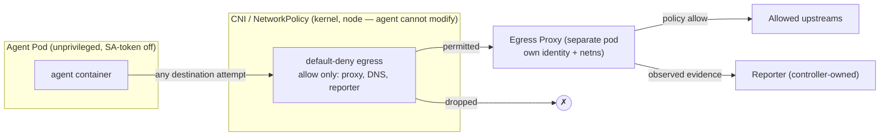

# Evidence Integrity — Mandatory Out-of-Pod Egress Chokepoint

**Status:** design (no code yet)
**Scope:** the remaining hardening of runtime-evidence integrity — moving egress governance from *cooperative* to *adversarial-grade* (`observed`) by relocating the enforcement point outside the agent's trust domain.
**Non-goals:** full eBPF/syscall/file observation in one pass; rewriting the reporter auth model; node-compromise defense (see Assumptions); implementing FQDN policy itself (that is [#32](https://github.com/grantbarry29/scrutineer/issues/32), which builds *on* this).
**Tracking:** [#8](https://github.com/grantbarry29/scrutineer/issues/8) (slices 1–3 shipped; this doc covers the remaining "independent `observed` source" hardening).

---

## 1. The crux

Scrutineer is only trustworthy if **the agent it governs cannot forge or suppress the evidence of what it did.** Everything else — audit, observability, the UI's credibility — leans on this.

Today's egress governance is **cooperative**: the `dns-proxy` runs as a sidecar *inside the agent pod*, sharing its network namespace and (historically) ServiceAccount. The agent reaches it via `HTTP_PROXY`. A compromised or prompt-injected agent can therefore:

- **Bypass** it — ignore `HTTP_PROXY` and open a raw socket directly to any destination.
- **Tamper** with or **starve** the sidecar — same pod, adjacent process.
- **Forge** evidence — evidence is `self-reported` from within the agent's own trust domain.

Slices 1–3 (shipped) made this *honest and least-privilege* — an `EvidenceAssurance` enum, `self-reported` stamping, SA-token isolation, assurance on audit records — but they do not close the bypass/tamper gap. This doc does.

## 2. Principle

> The integrity guarantee never comes from *which tool* we use (proxy, eBPF). It comes from the enforcement/observation point living in a **trust domain the agent has no privilege to alter**, and from making that point the **only path** for the governed traffic.

Two properties, both required:

1. **Out of the agent's control** — the enforcement component runs with its own identity/network namespace (a separate pod, or the kernel/node), not co-resident with the agent.
2. **Mandatory (non-bypassable)** — the agent's traffic is *forced* through it by a layer the agent cannot modify, so "just connect somewhere else" **fails** rather than escapes.

## 3. Architecture: mandatory out-of-pod egress chokepoint

Relocate the egress proxy out of the agent pod into a dedicated Deployment (per-namespace, own ServiceAccount/identity), and lock the agent pod's egress — via a CNI-enforced default-deny `NetworkPolicy` — to **only** the proxy (plus DNS and the reporter). The agent may *attempt* any destination; anything not via the proxy is dropped at the pod's veth boundary, outside the agent's network namespace.

Because the proxy is now outside the agent's trust domain, the evidence it reports is **`observed`**, not `self-reported` — the first independent evidence source #8 requires.

## 4. Why the agent cannot bypass or tamper

- **Bypass:** direct connections to non-proxy destinations are dropped by the **CNI**, which enforces `NetworkPolicy` at the pod boundary — *outside* the pod netns. Changing routes/iptables inside its own netns does not help; container-root does not help.
- **Modify policy:** the `NetworkPolicy` is a Kubernetes object the agent pod has **no RBAC** to change, and with SA-token automount off (slice 2) it cannot reach the API server at all.
- **Tamper with the proxy:** it is a separate pod with its own identity/netns — not an adjacent process the agent can signal, ptrace, or starve.
- **Forge evidence:** the proxy authenticates to the reporter with its **own** projected token; the reporter stamps its evidence `observed` based on that identity, and the agent has no path to impersonate it.

## 5. Assumptions and honest boundaries

This is adversarial-grade **for network egress** under these stated assumptions — the doc must never claim more:

1. **DNS is constrained** — DNS resolution is forced through the proxy or an allowed resolver; otherwise the agent can tunnel/exfiltrate over DNS. (Included in the chokepoint allow-list design.)
2. **The agent pod is unprivileged** — `drop ALL` capabilities, `seccomp: RuntimeDefault`, no `CAP_NET_ADMIN`. A pod that can reach host networking can defeat the boundary.
3. **The node / CNI is not compromised** — node compromise is a strictly higher threat tier and is **explicitly out of scope**. The guarantee is "the agent cannot tamper without escaping to the node."
4. **The CNI enforces egress `NetworkPolicy`** — not all CNIs do; document the requirement (Calico/Cilium do).
5. **Coverage is L3/L4 + L7 combined** — NetworkPolicy stops "connect by raw IP to evade domain policy" (dropped unless via proxy); the proxy makes the L7 (domain/FQDN) decision for traffic that does traverse it.

This closes the *cooperative → adversarial* gap for **egress**. Syscall/file observation (eBPF/Tetragon) remains a future, separate independent source and is out of scope here.

## 6. Relationship to #32 (FQDN egress)

[#32](https://github.com/grantbarry29/scrutineer/issues/32) is the *L7 policy* (FQDN allow/deny via Envoy/Cilium). This doc is the *trust boundary* (make egress mandatory and out-of-pod). They compose on one substrate: #8 delivers the non-bypassable out-of-pod chokepoint; #32 implements richer FQDN policy **at** that chokepoint. Build #8's boundary first so #32's policy is enforced somewhere the agent can't route around.

## 7. Increment plan

Sliced so each increment is independently reviewable and verifiable (`make test` in the devcontainer). Each is a tracked GitHub issue under #8.

- **Slice A — Out-of-pod egress proxy deployment.** Run the egress proxy as a dedicated Deployment + Service (own SA/identity, per-namespace) instead of an in-pod sidecar; the agent pod points at the shared proxy Service. Foundational; everything else depends on it.
- **Slice B — Mandatory routing (default-deny egress NetworkPolicy).** Extend `internal/enforcement/networkpolicy` + the controller to emit a default-deny egress policy on agent pods permitting only the proxy, DNS, and reporter. This is the non-bypassable primitive.
- **Slice C — `observed` evidence from the out-of-pod proxy.** The relocated proxy stamps egress evidence `observed`; `internal/reporter/normalize.go` accepts `observed` only from the trusted proxy identity (all in-pod/agent-adjacent sources stay `self-reported`).
- **Slice D — Opt-in + docs.** `RuntimeProfile` toggle to enable the mandatory-egress mode; component READMEs and this doc updated to describe the guarantee and its assumptions precisely.

Recommended order: A → B → C → D. Slice A is the first code increment.
