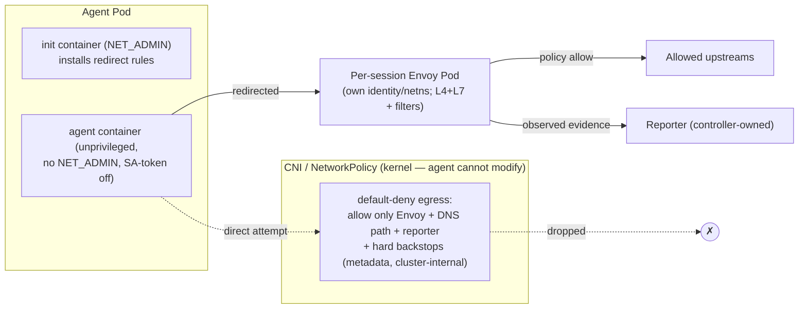

# Evidence Integrity — Mandatory Per-Session Egress Chokepoint (Envoy)

**Status:** design (no code yet)
**Scope:** the remaining hardening of runtime-evidence integrity — moving egress governance from *cooperative* to *adversarial-grade* (`observed`) by routing all agent egress through an **Envoy** proxy that lives outside the agent's trust domain and cannot be bypassed.
**Non-goals:** full eBPF/syscall/file observation in one pass; rewriting the reporter auth model; node-compromise defense (see Assumptions); a shared per-node gateway (a future evolution of the placement interface); implementing rich FQDN policy content (that is [#32](https://github.com/grantbarry29/scrutineer/issues/32), realized *at* this Envoy).
**Tracking:** [#8](https://github.com/grantbarry29/scrutineer/issues/8) (slices 1–3 shipped; this doc covers the remaining "independent `observed` source" hardening).

---

## 1. The crux

Scrutineer is only trustworthy if **the agent it governs cannot forge or suppress the evidence of what it did.** Everything else — audit, observability, the UI's credibility — leans on this.

Today's egress governance is **cooperative**: the `dns-proxy` runs as a sidecar *inside the agent pod*, sharing its network namespace and (historically) ServiceAccount, reached via `HTTP_PROXY`. A compromised or prompt-injected agent can **bypass** it (raw socket to anywhere), **tamper/starve** it (adjacent process), or **forge** evidence (`self-reported` from within its own trust domain).

Slices 1–3 (shipped) made this *honest and least-privilege* (`EvidenceAssurance` enum, `self-reported` stamping, SA-token isolation, audit assurance) but do not close the bypass/tamper gap. This doc does.

## 2. Principle

> Integrity never comes from *which tool* we use. It comes from the enforcement/observation point living in a **trust domain the agent has no privilege to alter**, and from making that point the **only path** for the governed traffic.

Two properties, both required: **out of the agent's control** (separate pod, own identity/netns) and **mandatory** (traffic forced through it by a layer the agent can't modify, so "connect elsewhere" *fails*).

## 3. Architecture

All agent egress is forced through a **per-session Envoy proxy** that runs as its **own pod** (own ServiceAccount/identity/netns), created and owner-referenced by the controller and torn down with the session. Envoy handles **both L4 (TCP) and L7 (HTTP / TLS-SNI)** filtering in one place, with a filter chain that future L4 features (IDS, packet capture, per-flow metrics) extend — none of which a `NetworkPolicy` could ever host.

**Placement is behind an interface.** Per-session is the first implementation (trivial attribution, tightest blast radius, no control-plane machinery). The same trust model + Envoy config generation can later back a **shared per-node gateway** for scale, without changing the guarantee.

**Routing enforcement — transparent redirect (chosen direction).** A privileged **init container** (`CAP_NET_ADMIN`) in the agent pod installs redirect rules so all outbound traffic is steered to the session's Envoy; the agent's **main container runs unprivileged** (`drop ALL`, `seccomp: RuntimeDefault`, no `NET_ADMIN`) so it cannot undo them. Transparency means the agent workload needs no proxy awareness. *(The exact mechanism for preserving the original destination to an out-of-pod Envoy is an open question — see §8.1.)*

**NetworkPolicy — defense-in-depth, not the L4 policy engine.** A CNI-enforced default-deny egress policy does two jobs the proxy can't guarantee alone:
1. **Routing lock** — permit egress only to the session's Envoy (+ the governed DNS path + reporter); everything else is dropped at the pod boundary, outside the agent netns. This is the backstop that holds even if the redirect rules are somehow defeated.
2. **Hard security backstops** — deny cloud metadata (`169.254.169.254`), cluster-internal/API ranges, and known-bad CIDRs. These must hold **even if Envoy itself is compromised**, so they live in the kernel/CNI, not in Envoy.

Rich, extensible L4+L7 policy and all `observed` evidence live in Envoy; the non-negotiables stay CNI-enforced.

**DNS.** Direct DNS is a tunneling/exfil channel, so it is governed too: DNS is redirected to a controlled resolver (in/beside Envoy), which resolves, applies name policy, and records the name→IP mapping so later L4 connections can be policy-checked by name (with TLS **SNI** / HTTP **Host** recovering the hostname directly for those protocols).

**Fail-closed.** If the Envoy pod or redirect isn't ready, the agent has **no egress** (start ordering gates the agent behind Envoy readiness). An outage denies egress rather than silently bypassing governance.

**Evidence.** Because Envoy is outside the agent's trust domain, its egress evidence is stamped **`observed`** (authenticated by Envoy's own identity to the reporter) — the first independent evidence source #8 requires. Agent-adjacent sources stay `self-reported`.

## 4. Why the agent cannot bypass or tamper

- **Bypass:** redirect steers traffic to Envoy; even if the agent defeats the redirect, the CNI drops all non-Envoy egress at the pod boundary (outside its netns). Container-root doesn't help.
- **Modify the redirect / policy:** the init container holds `NET_ADMIN`; the main container drops it, so the agent can't flush the rules. The `NetworkPolicy` is a k8s object it has no RBAC for and (SA-token off) can't reach the API to change.
- **Tamper with Envoy:** separate pod, own netns/identity — not an adjacent process the agent can signal/ptrace/starve.
- **Forge evidence:** Envoy authenticates to the reporter with its own token; the reporter stamps `observed` on that identity; the agent can't impersonate it.

## 5. Assumptions and honest boundaries

Adversarial-grade **for network egress** under these stated assumptions — never claim more:

1. **DNS is governed** (redirected to a controlled resolver); otherwise DNS tunneling/exfil is open.
2. **The agent main container is unprivileged** — `drop ALL`, `seccomp: RuntimeDefault`, no `CAP_NET_ADMIN`. A pod that can reach host networking defeats the boundary.
3. **The init container is privileged (`NET_ADMIN`) but agent-inaccessible** — it runs to completion before the agent starts; this raises the pod's Pod-Security posture (init needs elevated caps while the main container stays restricted — verify against target-cluster PSA, see §8.4).
4. **The node / CNI is not compromised** — a strictly higher threat tier, explicitly out of scope. The guarantee is "the agent can't tamper without escaping to the node."
5. **The CNI enforces egress `NetworkPolicy`** (Calico/Cilium do; document the requirement).
6. **Coverage is L4 + L7 combined at Envoy**, with CNI backstops for the non-negotiables.

This closes the *cooperative → adversarial* gap for **egress**. Syscall/file observation (eBPF/Tetragon) remains a separate future `observed` source, out of scope here.

## 6. Relationship to #32 (FQDN egress)

Envoy is the shared substrate. #8 delivers the non-bypassable per-session Envoy chokepoint + trust boundary; [#32](https://github.com/grantbarry29/scrutineer/issues/32) implements the richer FQDN allow/deny **as Envoy policy config** at that chokepoint. Build the boundary first so #32's policy is enforced where the agent can't route around it.

## 7. Increment plan

Each increment is an independently reviewable, `make test`-verifiable GitHub issue under #8.

- **Slice A ([#60]) — per-session Envoy egress proxy.** Controller creates a per-session Envoy pod (own SA/identity, owner-referenced, torn down with the session) behind a placement interface; agent egress is directed to it. Foundational.
- **Slice B ([#61]) — mandatory routing.** Transparent redirect (privileged init container; main container drops `NET_ADMIN`) **plus** the CNI default-deny egress `NetworkPolicy` (routing lock + hard backstops). Resolve §8.1 first.
- **Slice C ([#62]) — `observed` evidence.** Envoy stamps egress evidence `observed`; `internal/reporter/normalize.go` accepts `observed` only from Envoy's authenticated identity.
- **Slice D ([#63]) — opt-in + docs.** `RuntimeProfile` toggle; optional SA-token re-enable for agents that need API access; precise docs (never "tamper-proof" without the §5 boundaries).

Order: A → B → C → D. Slice A is the first code increment.

## 8. Open questions / design gaps (need decisions)

1. **Preserving original destination to an out-of-pod Envoy (blocks Slice B).** Transparent redirect (TPROXY/`SO_ORIGINAL_DST`) preserves the original destination only when the transparent listener is in the **same netns** (Istio's sidecar case). For a *separate* Envoy pod, a DNAT loses the original dst. Options: (a) a **minimal in-pod redirect shim** that TPROXYs locally and tunnels to Envoy carrying original dst (PROXY-protocol/HBONE-style) — a dumb, policy-free component whose bypass is still caught by NetworkPolicy; (b) **explicit proxy** (SOCKS5h + HTTP CONNECT) instead of transparent — conveys dst in-band, no shim, but the agent must be proxy-aware; (c) accept transparency only when we later move to a **per-node** gateway. This is the crux to settle before B.
2. **Protocol scope for the first increment** — TCP-only first? How do we treat **UDP / QUIC (HTTP/3 over UDP 443)** — block it (force TCP fallback) or defer UDP governance?
3. **DNS mechanism** — depends on §8.1: with explicit proxy, force name resolution at Envoy (deny direct DNS entirely); with transparent, redirect `:53` to a governed resolver.
4. **Pod Security / privileged init** — confirm the `NET_ADMIN` init container is acceptable under the target clusters' Pod Security Admission (baseline/restricted), and how we document/gate it.
5. **Evidence granularity/schema** — does the existing `PolicyDecision`/`PolicyViolation`/event schema capture L4 flow evidence (5-tuple, bytes, duration) well, or does it need an extension for connection-level records?
