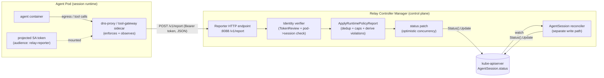
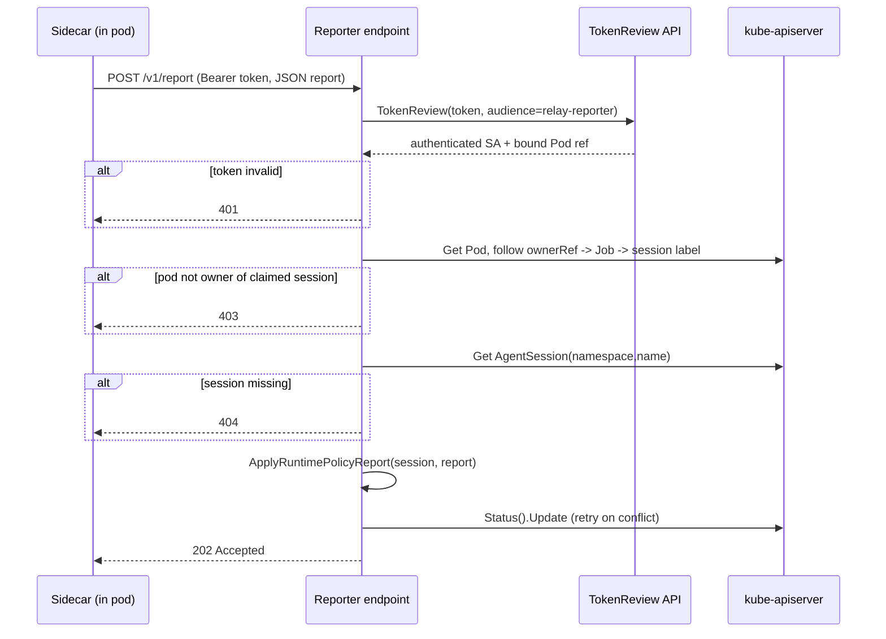

# Phase 3b Slice 1 — Runtime Reporter Contract (Design)

> **Status:** Design (this is the slice 1 deliverable). Implementation is **slice 2** (*Runtime reporter loop (impl)*).
> **Audience:** the engineer/agent implementing slice 2 and the data-plane sidecars.
> **Read first:** [`architecture.md`](architecture.md) · [`phase-3-enforcement-architecture.md`](phase-3-enforcement-architecture.md)

This document specifies **how a running data-plane sidecar reports runtime evidence back to the Relay controller**, so that `AgentSession.status.policyDecisions` and `AgentSession.status.violations` reflect what actually happened at runtime. It is the missing edge that turns *propagated* governance into *observed* governance.

This is a **contract specification**, not an implementation. It is intentionally prescriptive so the implementation slice can follow it closely.

---

## 1. Problem statement

Today the enforcement evidence helpers exist but **nothing in-cluster calls them**:

- `enforcement.RuntimeReport` is the evidence payload type (decisions + violations).
- `agentsession.ApplyRuntimePolicyReport(session, report)` merges a report into status (dedup, caps, derives violations from deny/dry-run decisions).
- `agentsession.ApplyEgressProxyRuntimeEvent(...)` adapts a dns-proxy event into a report.

All of these run **in-process inside the controller** and are only exercised by unit tests. A dns-proxy or tool-gateway sidecar running in the agent pod has **no path** to invoke them. As a result, `status.policyDecisions` only ever contains merge-time entries, and `status.violations` is always empty at runtime.

**Goal:** define a secure, idempotent, Kubernetes-native channel from sidecar → controller that ends in `ApplyRuntimePolicyReport` + a status patch.

---

## 2. Decision

> **Sidecars report over HTTP to a controller-owned reporter endpoint, which validates identity, then merges the report into `AgentSession.status` via the existing helpers. No new CRD.**

`AgentSession.status` remains the **single source of truth** for runtime evidence. The reporter is a thin ingestion edge in front of the merge helpers that already exist.

### 2.1 Alternatives considered

| Option | How | Verdict |
|--------|-----|---------|
| **A. Controller-owned PATCH callback (chosen)** | Sidecar POSTs a report to an HTTP endpoint served by the controller manager; controller validates and PATCHes status. | **Chosen.** Status stays canonical; controller keeps exclusive write access (no broad RBAC for sidecars); reuses merge helpers; testable with a fake HTTP client. |
| B. Sidecar PATCHes status directly | Give the session ServiceAccount RBAC to PATCH `agentsessions/status`. | Rejected: grants every agent pod write access to its own governance record — an injected/compromised agent could falsify its own audit trail. Violates least privilege and the trust model. |
| C. Kubernetes Events from sidecar + controller watcher | Sidecar emits Events; controller aggregates into status. | Rejected for MVP: Events are lossy/TTL'd, rate-limited, and awkward to carry structured decision payloads. Keep as a possible supplementary signal later. |
| D. Separate `SessionEvidence` CRD written by sidecars | New CRD; controller reconciles it into AgentSession status. | Rejected for MVP: adds a CRD and a second write path for the same data; revisit only if evidence volume outgrows status subresource limits. |

### 2.2 Why not just keep it in-process?

The enforcement *happens* in the data plane (a separate container/pod), not in the controller. The controller cannot observe egress/tool calls itself without coupling to a specific backend. A network boundary between producer (sidecar) and aggregator (controller) is inherent; this contract defines that boundary explicitly.

---

## 3. Architecture



Key properties:

- The reporter runs **inside the controller manager process** as a `manager.Runnable` (added via `mgr.Add(...)`), sharing the same client and cache. It is **not** the metrics or healthz server; it listens on its own port.
- The reporter and the reconciler both write `status` and therefore **must** use the same merge-and-retry strategy (see §7). They never assume exclusive access.
- Sidecars get **no** Kubernetes API RBAC. Their only privilege is "call the reporter for my own session."

---

## 4. Transport & endpoint

### 4.1 Server

- A new `manager.Runnable` (e.g. `internal/reporter`), started by `cmd/main.go` via `mgr.Add(reporter.New(...))`.
- Listens on a dedicated address, configurable via flag `--reporter-bind-address` (default `:8088`). Bound inside the cluster only; exposed to pods via a `Service` in a later wiring step (out of scope for the contract, noted for impl).
- Graceful shutdown tied to the manager's `context.Context`.

### 4.2 Endpoint

```
POST /v1/report
Authorization: Bearer <projected-serviceaccount-token>
Content-Type: application/json
```

Single endpoint for the MVP. Versioned path (`/v1/`) so the payload schema can evolve.

### 4.3 Request body

```jsonc
{
  "session": {
    "namespace": "team-a",        // must match the caller's pod namespace
    "name": "nightly-crawl"        // AgentSession name
  },
  "backend": "egress-proxy",       // enforcement.BackendKind: networkpolicy|egress-proxy|tool-gateway
  "reportId": "f3c1...",           // optional client-generated idempotency key
  "decisions": [
    {
      "time": "2026-06-08T23:14:05Z",
      "phase": "runtime",          // MUST be "runtime"; merge-time entries are controller-only
      "type": "network",           // network|tool|approval|cap|file
      "action": "deny",            // allow|deny|audit|dry-run
      "target": "evil.example.com",
      "reason": "DeniedDomain",
      "message": "egress to evil.example.com blocked",
      "mode": "enforced",
      "actor": "egress-proxy"
    }
  ],
  "violations": []                  // optional; usually derived from decisions by the controller
}
```

The `decisions[]` / `violations[]` element shapes map **1:1** onto the existing `relayv1alpha1.PolicyDecision` / `relayv1alpha1.PolicyViolation` API types. The wire payload deserializes into `enforcement.RuntimeReport`. **Do not invent a parallel schema** — reuse the API types.

### 4.4 Responses

| Status | Meaning | Sidecar behavior |
|--------|---------|------------------|
| `202 Accepted` | Report validated and merged (or no-op). | Done. |
| `400 Bad Request` | Malformed JSON / missing required fields / `phase != runtime`. | Fix payload; do not retry as-is. |
| `401 Unauthorized` | Missing/invalid token. | Re-acquire token, retry with backoff. |
| `403 Forbidden` | Token valid but pod is not authorized for the claimed session (cross-session report). | Do not retry; log; this is a misconfiguration or attack. |
| `404 Not Found` | AgentSession does not exist (deleted/terminal-GC). | Drop the report. |
| `409 Conflict` | Status update lost optimistic-concurrency race after internal retries. | Retry with backoff (the controller should retry internally first). |
| `413 Payload Too Large` | Body exceeds `maxReportBytes`. | Split/trim and resend; client must cap batch size. |
| `429 Too Many Requests` | Per-session rate limit exceeded. | Back off using `Retry-After`. |

`202` (not `200`) signals "accepted for merge," allowing the controller to apply asynchronously if it later batches writes. For the MVP, merge happens synchronously before responding.

---

## 5. Identity & authorization model

This is the security core of the contract. The threat is a **prompt-injected or compromised agent** trying to (a) erase its own violations, (b) forge "allow" decisions, or (c) report on behalf of another session.

Because the controller is the only writer (§2.1 option A), an agent **cannot** edit status directly. The remaining risk is forging reports. The reporter mitigates this:

### 5.1 Authentication — projected ServiceAccount token (MVP)

1. The session pod mounts a **projected ServiceAccount token** with `audience: relay-reporter` and a short expiry (e.g. 600s, auto-refreshed by kubelet). This is added to the sidecar (and only the sidecar container) when the reporter feature is enabled — wiring detail for the sidecar-injection slice.
2. The sidecar sends this token as `Authorization: Bearer`.
3. The reporter calls the Kubernetes **`TokenReview`** API with the expected audience. TokenReview returns the authenticated username (the pod's ServiceAccount, e.g. `system:serviceaccount:team-a:default`) and, for bound tokens, a `BoundObjectRef` identifying the **Pod** the token was issued for.

### 5.2 Authorization — pod must own the session it reports for

After authentication, the reporter verifies the report targets the caller's **own** session:

1. Resolve the calling **Pod** (from the token's bound object ref, or from a required `X-Relay-Pod` header cross-checked against the token's namespace).
2. Confirm `pod.metadata.namespace == body.session.namespace`.
3. Walk ownership: `Pod → ownerRef(Job) → Job.labels["relay.secureai.dev/session"]` **or** the Job's ownerRef back to the AgentSession. Confirm it equals `body.session.name`.
4. If any check fails → `403`.

This guarantees a sidecar can only ever populate evidence for the exact session it runs in. Namespace isolation is preserved.



### 5.3 Hardening (deferred — track as follow-ups, do NOT build in slice 2)

- mTLS between sidecar and reporter (SPIFFE/SPIRE or cert-manager issued identities).
- Signed reports + replay protection (nonce/`reportId` cache).
- Admission-time injection of the projected token + reporter `Service` discovery via env.

These are explicitly **out of scope** for the impl slice; see §10.

---

## 6. Payload → status mapping

The controller does **not** trust client-supplied fields blindly:

| Field | Controller handling |
|-------|---------------------|
| `phase` | **Forced** to `runtime`. Reject (`400`) if the client sends anything else. Runtime reports can never write merge-time entries. |
| `time` | If zero/missing, set to server receive time. Never trust future timestamps beyond a small skew window. |
| `actor` | If empty, default to `backend`. |
| `mode` | Informational; the controller may overwrite with `status.effectivePolicy.mode` for consistency. |
| `action` | Used as-is for the audit record. Violations are **derived by the controller** from `deny`/`dry-run` actions via `enforcement.ViolationsFromDecisions`; client-supplied `violations[]` are merged but de-duplicated. |
| `decisions[]` length | Capped by `enforcement.MaxPolicyDecisions`; `violations[]` capped by `enforcement.MaxViolations`. |

The merge itself is **exactly** the existing helper:

```go
// pseudocode inside the reporter handler
report := enforcement.RuntimeReport{Decisions: decisions, Violations: violations}
agentsession.ApplyRuntimePolicyReport(session, report) // dedup + caps + derive
// then patch status (see §7)
```

---

## 7. Concurrency & idempotency

The reporter and the reconciler both write `status`. The reporter MUST:

1. Read the live `AgentSession` (uncached `APIReader` to avoid stale cache overwrites — same reasoning as the existing finalizer/delete path).
2. Apply the report onto the live object.
3. `Status().Update` with the live `resourceVersion` (optimistic concurrency).
4. On `409 Conflict`, **retry internally** (e.g. up to N times with jittered backoff) before surfacing `409` to the client.

Idempotency:

- `ApplyRuntimePolicyReport` already de-duplicates decisions by `(time, phase, type, reason, target, action)` and violations by their key, so **re-delivering the same report is safe** and converges.
- The optional `reportId` may back a short-lived seen-cache to short-circuit duplicates cheaply; not required for correctness.

Ordering: decisions are appended in arrival order; consumers sort by `time` for display. The contract does **not** guarantee global ordering across sidecars.

---

## 8. Abuse & resource controls

| Control | Default | Rationale |
|---------|---------|-----------|
| `maxReportBytes` | 64 KiB | Bound memory per request; `413` beyond. |
| `maxDecisionsPerReport` | 128 | Prevent a single call from blowing the status cap churn. |
| Per-session rate limit | e.g. 1 req/s burst 5 | Prevent status-write floods; `429` + `Retry-After`. |
| Status caps | `MaxPolicyDecisions` / `MaxViolations` (64) | Existing truncation with summary entry. |

Rate limiting is per `(namespace, session)`. A noisy or hostile sidecar cannot degrade other sessions.

---

## 9. Observability of the reporter

The reporter is itself an audited surface:

- Emit a Kubernetes Event on the AgentSession for the **first** runtime violation observed (e.g. `Warning RuntimeViolation`), so `kubectl describe` surfaces it. Avoid per-decision event spam.
- Controller metrics (Phase 4 wiring): reports received/accepted/rejected by reason, merge latency, status-conflict retries. Define names later; leave hooks.

---

## 10. Scope for the implementation slice (slice 2)

**In scope (slice 2 — Runtime reporter loop (impl)):**

1. `internal/reporter/` package: `manager.Runnable` HTTP server, handler for `POST /v1/report`, JSON decode into `enforcement.RuntimeReport` + session ref.
2. Identity verification: `TokenReview` + pod→session ownership check (§5).
3. Merge via `agentsession.ApplyRuntimePolicyReport` + status update with `APIReader` read and conflict retry (§7).
4. Wire into `cmd/main.go` (`mgr.Add`) and a `--reporter-bind-address` flag.
5. RBAC: controller `ServiceAccount` needs `authentication.k8s.io/tokenreviews: create` and existing AgentSession/Pod/Job read; **no** new sidecar RBAC.
6. Tests (per workflow rule for evidence slices): table-driven handler tests with a **simulated/fake report** showing `status.policyDecisions` + `status.violations` populated; auth rejection (`401`/`403`); cap enforcement; idempotent re-delivery; `phase != runtime` rejected.

**Explicitly out of scope (track as follow-ups, do not build):**

- Real dns-proxy/tool-gateway images that *call* this endpoint (separate evidence-loop slices #4/#5).
- Projected-token injection + reporter `Service` wiring into the sidecar/pod template (sidecar-injection follow-up).
- Structured `status.events[]` schema (evidence-loop slice #3) — the reporter is forward-compatible: an `events[]` block can be added to the request body later.
- mTLS, signed reports, replay protection (§5.3 hardening).
- Prometheus metric names (Phase 4).

Each out-of-scope item above must already be a card in `.cursor/relay-project-status.md` (evidence loop or Phase 4) or be added there before the impl slice closes.

---

## 11. Acceptance criteria (slice 2)

- A simulated `POST /v1/report` with a `deny` runtime decision results in one `status.policyDecisions` entry (`phase=runtime`) **and** one derived `status.violations` entry, proven by an envtest or handler test.
- An unauthorized/cross-session report is rejected (`401`/`403`) and writes nothing.
- Re-delivering the same report does not duplicate entries (idempotent).
- Decisions beyond `MaxPolicyDecisions` are truncated with the existing summary behavior.
- `make test` passes.

---

## 12. Open questions (resolve during impl, not blocking the contract)

- Bound-token `BoundObjectRef` availability vs. requiring an explicit `X-Relay-Pod` header — pick based on the cluster K8s version floor (≥1.31 in CI).
- Whether to expose the reporter via a headless `Service` + DNS name injected as `RELAY_REPORTER_URL`, mirroring `RELAY_TOOL_GATEWAY_URL`.
- Whether a first runtime violation should also flip a `Ready`/new condition (likely a Phase 4 concern; keep status conditions stable for now).
