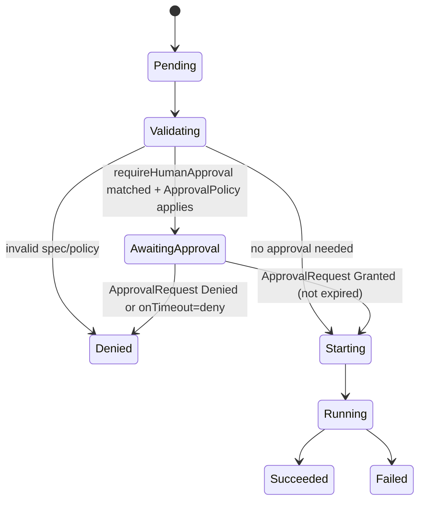

# Phase 5 — Human Approval Workflows

> **Status:** Design (Phase 5 · slice 1). No code yet. Defines the CRD shapes, controller gate/resume state machine, and invariants for scoped, auditable approvals. Implementation lands in later slices (see `.cursor/relay-project-status.md` → *Phase 5 approval workflows*).

## Purpose

Today `policy.requireHumanApproval` is **declared and propagated but not enforced**: the controller only emits an `ApprovalNotEnforced` warning event and runs the session anyway. Phase 5 turns approval into a **real, scoped, auditable gate** — a session that requires approval does not execute until a human grants a matching, time-bounded approval, and every decision is recorded for audit.

This aligns with the product vision (*Policy And Enforcement Model*): "Human approval should become scoped and auditable: approve one tool call, domain, file write, deployment, credential use, or bounded time window rather than a broad boolean."

## Scope of this design

- `ApprovalPolicy` CRD — **what** requires approval (reusable, declarative).
- `ApprovalRequest` CRD — **per-pending-decision** object a human acts on.
- Controller **gate/resume** state machine on `AgentSession` (new `PhaseAwaitingApproval` + `ApprovalRequired` condition).
- Audit surface: `status.policyDecisions` (`type: approval`) + Kubernetes events.

## Non-goals

- Mid-execution, per-tool-call runtime approval (agent pauses on a specific tool invocation). This design covers **pre-execution session gating** first; runtime per-action approval is a later slice that reuses `ApprovalRequest`.
- External integrations (Slack/PagerDuty) — separate slice (notification hooks).
- A UI approval inbox — Phase 7.
- Credential issuance on approval — Phase 8 (`CredentialProfile`).
- Changing the existing policy merge model; `ApprovalPolicy` is referenced like other policies.

## Relationship to existing model

| Existing | Phase 5 change |
|----------|----------------|
| `policy.requireHumanApproval: []string` (action types) | Kept as the **trigger signal**. When non-empty (after merge), the session needs approval. `ApprovalPolicy` refines *how* it is gated (approvers, expiry, scope granularity). |
| `EventReasonApprovalNotEnforced` warning | Replaced by real gating once an `ApprovalPolicy` applies; warning retained only when approval is declared but **no** `ApprovalPolicy`/gate is configured (explicit opt-out / audit-only). |
| `status.policyDecisions` `type: approval` (currently `audit`) | Gains runtime `allow`/`deny` entries when a request is granted/denied. |

## CRD sketches

> Field names are a design proposal; finalize during slice 2. Namespace-scoped, same-namespace references only (matches existing ref scoping).

### `ApprovalPolicy` (declarative — slice 2 — **shipped 2026-06-21**)

Shipped in `api/v1alpha1/approvalpolicy_types.go` (CRD `approvalpolicies`, short names `appol`/`approvalpol`). `requirement` (`default`/`allOf`, default `default`) and `onTimeout` (`deny`/`allow`, default `deny` — fail closed) are enum-validated with defaults; `actions` is required (`minItems: 1`); `approvers[].kind` is an enum (`User`/`Group`/`ServiceAccount`); `expiresAfter` is a Go duration string. No controller behavior yet (slice 3). Sample: `config/samples/relay_v1alpha1_approvalpolicy.yaml`.

```yaml
apiVersion: relay.secureai.dev/v1alpha1
kind: ApprovalPolicy
metadata:
  name: prod-deploys
  namespace: team-a
spec:
  # Which action types this policy gates. Matches against the action types
  # surfaced by requireHumanApproval / runtime decisions.
  actions: ["deploy", "credential-use"]
  # Who may approve. MVP: subjects checked at decision time (see open questions).
  approvers:
    - kind: Group
      name: platform-oncall
  # How long a granted approval stays valid before the session must re-request.
  expiresAfter: 1h
  # default | allOf — number of distinct approvers required.
  requirement: default        # default = 1 approver
  # What happens if no approval arrives before the session/approval deadline.
  onTimeout: deny             # deny | allow (audit-only escape hatch)
```

`status`: `observedGeneration` (reserved), later usage counters.

### `ApprovalRequest` (per-decision object — slice 3 — **shipped 2026-06-21**)

Shipped in `api/v1alpha1/approvalrequest_types.go` (CRD `approvalrequests`, short names `appreq`/`approvalreq`). Created **by the controller** (owner-referenced by the `AgentSession`) when a gated session needs approval. Humans act on it by patching `spec.decision` (RBAC-scoped) or via a future UI/CLI. `spec.decision` is enum `""`/`granted`/`denied`; `status` (controller-owned) carries `state`/`decidedBy`/`decidedAt`/`expiresAt`/`reason`. One request per session (name = session name, 1:1 for MVP).

```yaml
apiVersion: relay.secureai.dev/v1alpha1
kind: ApprovalRequest
metadata:
  name: my-session-deploy        # derived, stable per (session, scope)
  namespace: team-a
  ownerReferences: [{ kind: AgentSession, name: my-session, ... }]
spec:
  sessionRef: { name: my-session }
  policyRef:  { name: prod-deploys }
  action: deploy                  # the gated action type
  scope:                          # what is being approved (bounded)
    target: "cluster/prod"        # optional: domain/tool/path/deploy target
    window: 1h                    # bounded validity once granted
  # Human-set decision (the only mutable part for approvers):
  decision: ""                    # "" (pending) | granted | denied
status:
  state: Pending                  # Pending | Granted | Denied | Expired
  decidedBy: ""                   # subject who set the decision
  decidedAt: null
  expiresAt: null                 # set when granted (now + scope.window)
  reason: ""
```

**Invariants:**
- The controller is the only writer of `status`; approvers only set `spec.decision` (enforced by RBAC + optional future validating webhook).
- An `ApprovalRequest` is owned by exactly one `AgentSession`; deleting the session garbage-collects it.
- Idempotent: re-reconciling a pending session does not create duplicate requests for the same `(session, action, scope)` — name is derived from that tuple.

## Controller gate/resume state machine

New phase `PhaseAwaitingApproval` and condition `ApprovalRequired` (proposed constants).



**Reconcile logic (slice 3 — implemented):** see `internal/controller/agentsession/approval.go` (`reconcileApprovalGate`), wired in `reconciler.go` between the terminal check and `ensureJob`.

> MVP semantics note: the gate is keyed on **one** `ApprovalRequest` per session (name = session name). `ApprovalPolicy.expiresAfter` is enforced as the **decision deadline** (measured from request creation): if no decision arrives before it, `onTimeout` applies (`deny` → `Denied`, `allow` → proceed). Grant-validity windows, multi-scope requests, and consume-time TOCTOU re-checks are deferred to later slices. Cancellation while `AwaitingApproval` is handled by the existing `cancelRequested` path (terminal `Cancelled`, no Job).

1. After validation + policy resolve, if effective `requireHumanApproval` is non-empty **and** a matching `ApprovalPolicy` applies:
   - Do **not** create the Job.
   - Ensure an `ApprovalRequest` exists (create if missing, owner-ref the session).
   - Set `phase = AwaitingApproval`, condition `ApprovalRequired = True`, emit `ApprovalRequested` event, append `policyDecisions{type: approval, action: audit, reason: ApprovalRequired}`.
   - Re-reconcile is triggered by a **watch on `ApprovalRequest`** (map → owning session).
2. When the `ApprovalRequest` reaches `Granted` and `now < expiresAt`:
   - Proceed to `Starting` (create Job as today); condition `ApprovalRequired = False` (reason `Approved`); append `policyDecisions{type: approval, action: allow, actor: <decidedBy>}`; emit `ApprovalGranted`.
3. When `Denied` or `Expired` (and `onTimeout: deny`):
   - Terminal `phase = Denied`; emit `ApprovalDenied`; append `policyDecisions{type: approval, action: deny}`.
4. **Cancellation** (`spec.cancelRequested`) while `AwaitingApproval`: terminal `Cancelled`, no Job, request marked `Expired`.

**Invariants:**
- A gated session **never** creates a Job before a non-expired grant exists (the core safety property).
- Approval evidence is control-plane authoritative → `policyDecisions` entries get `assuranceLevel: controller` (see evidence-integrity work).
- Idempotent and watch-driven (no busy-poll); reuses the existing status-patch union-merge.
- Expiry is enforced at consume time (re-check `now < expiresAt` immediately before Job creation) to avoid TOCTOU on a stale grant.

## Audit trail

Every transition records **who** (`decidedBy`), **when** (`decidedAt`), **scope** (`action` + `scope.target`/`window`), and **expiry** — on the `ApprovalRequest.status`, mirrored into `AgentSession.status.policyDecisions` and Kubernetes events. This answers the vision's audit questions: who authorized the run and under what bounded scope.

## Open questions (resolve in slice 2/3)

1. **Approver authn/authz:** MVP = Kubernetes RBAC on `patch ApprovalRequest spec.decision` (only authorized subjects can grant). **Slice 5 (shipped 2026-06-21)** adds best-effort identity: approvers self-declare `spec.decidedBy`, mirrored to `status.decidedBy` and used as the approval decision actor. This is **not authenticated** — capturing the real apiserver `userInfo` still needs a future validating webhook (deferred).
2. **`approvers` matching:** **resolved (slice 5):** enforced by the gate — a grant is honored only when `spec.decidedBy` matches a listed `ApprovalPolicy.approvers[].name` (match by name; Kind advisory). Empty `approvers` ⇒ any grant accepted (RBAC is the gate). An unlisted grant keeps the session `AwaitingApproval` and emits `ApprovalUnauthorized`.
3. **Multiple required approvers (`allOf`)** — **resolved (slice 6, shipped 2026-06-21):** when `requirement: allOf` and `approvers` is non-empty, the gate accumulates each valid grant's `spec.decidedBy` into controller-owned `ApprovalRequest.status.approvedBy[]` and only opens once that set covers every listed approver; until then the session stays `AwaitingApproval` and emits `ApprovalPartiallyApproved`. The approval `policyDecision` actor is the joined approver set. **Fail-closed limitation:** approvers grant sequentially through the single `spec.decidedBy` field, so two grants coalesced into one reconcile record only the latest grantor — the missed approver simply re-submits; the gate never opens early. An `allOf` policy with no listed approvers degenerates to single-approver. A list-typed multi-grant spec + authenticated identity (webhook) is future work.
4. **Per-tool runtime approval** — reuses `ApprovalRequest` but needs the agent/tool-gateway to block mid-call; separate design once gateway enforcement is adversarial-grade.

## Implementation slices (tracking)

See `.cursor/relay-project-status.md` → *Discovered Follow-Up Tasks → Phase 5 approval workflows*:

1. **This doc** (design). — **done**
2. `ApprovalPolicy` CRD (declarative only). — **done (2026-06-21)**
3. `ApprovalRequest` CRD + controller gate/resume + `PhaseAwaitingApproval`. — **done (2026-06-21)**
4. Notification hooks (generic webhook → Slack/PagerDuty adapters). — **done (2026-06-21)** — `internal/approval` `Notifier` (noop + webhook); reconciler fires once on gate open (annotation-guarded, best-effort, retried); `--approval-webhook-url` flag. Slack/PagerDuty are future adapters over `Notifier`.
5. Approver allowlist (best-effort `decidedBy`). — **done (2026-06-21)** — see open questions #1/#2.
6. Multi-approver (`allOf`). — **done (2026-06-21)** — `status.approvedBy[]` accumulation; gate opens on full coverage; `ApprovalPartiallyApproved` event. See open question #3.

## Related

- [`architecture.md`](architecture.md) — control/data-plane split, lifecycle, status merge.
- [`phase-3-runtime-reporter-contract.md`](phase-3-runtime-reporter-contract.md) §5 — evidence assurance levels.
- Product vision *Policy And Enforcement Model* and *Trust And Threat Model*.
