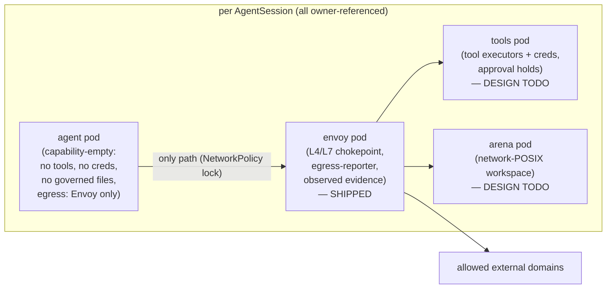

# The Untamperable Pivot — Enforcement Only From Sources the Agent Cannot Alter

**Status:** landed — Phases 0–2 shipped (#70 lock gate `cfdd9c0`, #71 removal `b9ceaa8`); Phase 3 hardening tracked under epic #69
**Scope:** the product pivot to **adversarial-grade-only enforcement**: retire the cooperative in-pod enforcement tier entirely, make the untamperable L4/L7 egress path (per-session out-of-pod Envoy + default-deny routing lock) the sole enforcement plane, add the **verified-or-refused** lock gate, and defer tool/file governance to out-of-pod chokepoint designs ([`tools-pod-chokepoint.md`](tools-pod-chokepoint.md), [`arena-workspace.md`](arena-workspace.md)).
**Non-goals:** implementing the tools pod or arena pod now (design-doc TODOs); node-level transparent interception (#64, unchanged); syscall/eBPF observation; node-compromise defense (same assumption as [`evidence-integrity.md`](evidence-integrity.md)); multi-arch UI/story changes.
**Tracking:** pivot epic #69 (children: #70 gate, #71 removal, #74 residue purge); builds on #8 (shipped) and #32 (shipped); absorbs #25/#33 as deferred designs; reshapes #55; #64/#66 unchanged.

---

## 1. The decision

Scrutineer ships **only** enforcement that a non-cooperating agent cannot bypass, tamper with, or starve. Every enforcement or observation point must satisfy both properties from [`evidence-integrity.md`](evidence-integrity.md):

1. **Out of the agent's control** — separate pod, own ServiceAccount/identity, own network namespace.
2. **Mandatory** — the agent's *only* working path for the governed action, enforced by a layer the agent cannot modify (today: the default-deny NetworkPolicy routing lock).

The cooperative in-pod tier (dns-proxy, tool-gateway, fs-gateway sidecars) is **removed, not deprecated**. A control the agent must opt into is advisory; advisory controls presented as governance are the exact failure mode this product exists to eliminate. The pitch after this pivot is one sentence with no asterisks: *if Scrutineer says it happened, it happened; if Scrutineer says it was blocked, it was blocked.*

### Why now

- The untamperable path already exists and is e2e-proven on two CNIs: per-session Envoy pod with dedicated identity, FQDN policy → RBAC (exact + `*.` wildcard), enforce/dry-run modes, JSON access log → egress-reporter → `observed` evidence with server-side assurance stamping, config-drift handling.
- The maintenance cost of two tiers is real: five first-party images, three injection paths, doubled e2e and docs — and effort spent on the cooperative tier hardens a boundary a malicious agent simply walks around.
- Pre-1.0, no install base, established clean-break precedent (#65). The cost of removal is entirely internal, and it shrinks over time while the cost of keeping two tiers grows.

## 2. Doctrine (the invariants this pivot adds)

1. **Untamperable or absent — never advisory.** No enforcement component ships that shares the agent's trust domain. If a governance domain (tools, files) has no out-of-pod chokepoint yet, Scrutineer declares nothing for it rather than enforcing weakly: no CRD fields without an enforcement backend.
2. **Verified or refused.** Where a guarantee depends on cluster behavior, Scrutineer proves it empirically before claiming it. Concretely: the routing lock is only real on a CNI that enforces NetworkPolicy; the controller must verify this (§4) and **refuse to run enforced sessions** — with a loud condition — when it cannot. Silent degradation to unenforced is prohibited.
3. **Assurance labels stay.** Everything Scrutineer records post-pivot is `observed`, but the `EvidenceAssurance` vocabulary is retained: it is how the API stays honest if a weaker signal is ever reintroduced, and how audit consumers distinguish sources. (The intent-vs-observed diff also returns with the tools pod, where the tool-call payload is intent — observed at the chokepoint this time.)

## 3. Target architecture

The Envoy pod pattern (controller-created per-session pod + Service + ConfigMap + dedicated SA, config-hash drift handling, reporter caller-class → `observed`) is the template every future chokepoint reuses. Pod boundaries are trust boundaries: in-pod placement can never yield more than tamper-resistance, because containers share the pod's network namespace, network identity (pod IP — peer selectors cannot distinguish containers), and ServiceAccount.

## 4. The lock-verification gate (first code slice)

**Problem:** on a CNI that does not enforce NetworkPolicy (default kind/kindnet, various managed defaults), the routing lock silently no-ops and "untamperable" becomes false without any signal. Post-pivot the lock *is* the product; its absence must be loud and blocking.

**Design: probe-only — verified or refused. No attestation override.**

- **Differential canary probe.** The controller creates two short-lived probe pods in its own namespace: one selected by a deny-all-egress NetworkPolicy, one not. Both attempt the same egress (as shipped: TCP to a kube-dns **pod IP** — a pod-network target, because host-network endpoints like the apiserver are exempt from egress NetworkPolicy on many CNIs). Expected: control pod **succeeds**, locked pod **fails**. Any other combination is conclusive: control-fails ⇒ broken network (indeterminate, keep last-known-good); both-succeed ⇒ CNI not enforcing ⇒ **refuse**.
- **Probe pods run the controller's own image** (already pullable wherever the controller runs — no extra registry/airgap surface) with a tiny probe subcommand, restricted-PSA-compliant (nonroot, no caps, read-only rootfs), predictable labels for admission allowlisting.
- **Cadence & caching:** probe at controller startup, then periodically in the background; enforced-session admission consults the cached verdict (with TTL). Flakes degrade to last-known-good, never flap running sessions. Per-node probing is a follow-up hardening step (enforcement can be partial across nodes); start with cluster-level.
- **Surface:** a controller-level readiness signal plus a per-session condition (e.g. `EgressLockVerified=True/False` with reason). An enforced-mode session on an unverified cluster does not start its runtime; it sits Pending/Blocked with the condition explaining exactly why and what to fix. Dry-run/audit-only sessions may run (they claim observation strength honestly via conditions, not enforcement).
- **No override flag.** If a legitimately unprobeable environment ever materializes, the escape hatch is a future *attested-but-labeled* tier (condition says operator-attested, not verified) — designed then, not speculatively. Never a silent bypass.

**e2e:** the two-cluster networking suite is purpose-built for this — kindnet cluster must refuse enforced sessions (and say why), Calico cluster must verify and run them.

## 5. The removal (second code slice)

**Deleted** (binaries, `internal/enforcement/*` packages, Dockerfiles, Makefile targets, release-matrix entries, injection wiring in `internal/controller/job/sidecars.go`, e2e specs):

- `cmd/dns-proxy` + `internal/enforcement/dnsproxy` — fully superseded by Envoy + lock (DNS-level policy adds nothing the L7 chokepoint doesn't already prove).
- `cmd/tool-gateway` + `internal/enforcement/toolgateway` — the *policy logic* (allow/deny, argument rules, approval holds) is inherited by the tools-pod design; the in-pod placement dies.
- `cmd/fs-gateway` + `internal/enforcement/workspace` enforcement path — inherited by the arena design.

**API surgery (completed across #71 + #75):** `RuntimeProfile.spec.enforcement[]` keeps its generic shape with `envoy` as the only valid type. #71 initially retained the tool/file policy fields as inert declared data (a recorded deviation); #75 resolved that deviation with the full clean break — the `ToolPolicy` CRD and every unenforced `PolicyRules` field (tool/path rules and all caps, including `maxNetworkRequests`) are **removed**. `PolicyRules` now carries only backed fields: network rules (Envoy/NetworkPolicy) and `requireHumanApproval` (controller approval gate). Doctrine #1 holds without exception; the removed schema lives in git history and returns, likely reshaped, with the tools/arena designs.

**Kept:**

- `ApprovalRequest` CRD, the reporter approval channel, and the approval state machine — dormant, reused as-is by the tools pod.
- The full reporter identity/assurance machinery (caller classes, server-side stamping), `EvidenceAssurance` vocabulary, `status.policyDecisions`/`violations`/`events` surfaces.
- The egress path end to end, untouched.

**e2e rework:** the live-evidence specs that used dns-proxy as their evidence vehicle (network violation, standalone-reporter evidence path, etc.) are rebuilt on the Envoy path — the fqdn/observed-evidence specs already demonstrate the pattern.

**Release matrix:** first-party images drop from five to two (`scrutineer`, `scrutineer-egress-reporter`); the release workflow matrix and image-pinning guard shrink accordingly (change-together site).

## 6. Interim posture and known gaps (stated, not hidden)

| Gap | Posture until closed | Closed by |
|---|---|---|
| Tool-level governance (incl. approval holds) has no enforcement backend | No tool policy surface exists (removed, not unenforced-but-declared — #75) | [`tools-pod-chokepoint.md`](tools-pod-chokepoint.md) (epic #76, unscheduled) |
| File/workspace governance | Same — workspace is an ungoverned volume | [`arena-workspace.md`](arena-workspace.md) |
| Bypass *attempts* leave no evidence (CNI drops direct connects silently; Envoy only sees traffic that arrived) | Documented blind spot — decided (#72): defer wholly to #64; interim options compared and rejected/contingency-recorded in [`bypass-attempt-evidence.md`](bypass-attempt-evidence.md) | #64 node interceptor (unforgeable node-observed attempts) |
| TLS egress is CONNECT-opaque (authority-only filtering) | Documented; L7 body visibility only for plain HTTP / in-cluster hops | tools-pod hop is plain HTTP via proxy; external TLS stays authority-filtered |
| IPv6 / dual-stack lock coverage | **Closed (#66)** — posture decided: the egress path is IPv4-only and IPv6 is denied *by construction* (no rendered policy contains a v6 allow; the lock is selector-based and family-agnostic; Envoy resolves `V4_ONLY`). Proven on a dual-stack kind cluster (`make test-e2e-net-dual`). Opening v6 egress is a future posture change, not a knob | #66 (shipped) |

## 7. Sequencing

| Phase | Content | State |
|---|---|---|
| 0 | This doc + vision rewrite + deferred-design drafts + board re-triage | shipped (`dfeab37`) |
| 1 | Lock-verification gate (§4) | shipped (#70, `cfdd9c0`) — verified on kindnet + Calico |
| 2 | Removal (§5) | shipped (#71, `b9ceaa8`; residue purge #74; API clean-break completion #75) |
| 3 | Hardening backlog | shipped — #66 IPv4-only dual-stack posture + dual-stack e2e flavor (`10eccc2`), #72 bypass-attempt evidence note → defer to #64 (`68bc838`), #55 egress-path metrics (`45c2123`); TLS CONNECT-opacity posture documented (§6 row + root README guarantees) |
| deferred | Tools pod (epic #76), arena pod, credential mediation (#25, absorbed by #76), sandboxes (#29), transparent interception (#64) | design docs / epics |

## 8. Superseded documents

The five cooperative-tier design docs (`phase-3-dns-proxy-prototype`, `phase-3-tool-gateway-contract`, `phase-3-tool-argument-constraints`, `phase-3-file-workspace-policy`, `phase-5-runtime-tool-approval`) were **deleted** in the post-pivot cleanup (#74); git history (pre-#74 `docs/design/`) is the record of what was built and why. Their surviving surfaces live in code and successor designs: the argument-constraint/tool/path schema lives in git history (removed with `ToolPolicy` in the #75 clean break), the approval-hold protocol is the dormant `ApprovalRequest` runtime variant + reporter approval channel, and both are inherited by [`tools-pod-chokepoint.md`](tools-pod-chokepoint.md) / [`arena-workspace.md`](arena-workspace.md).
